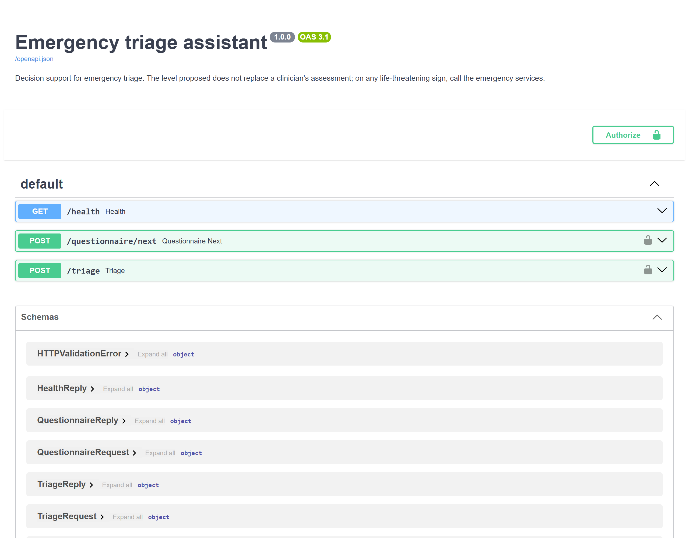
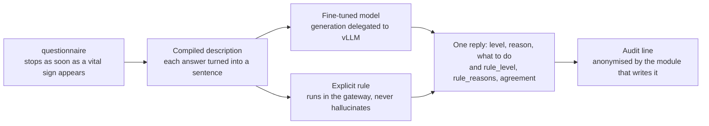
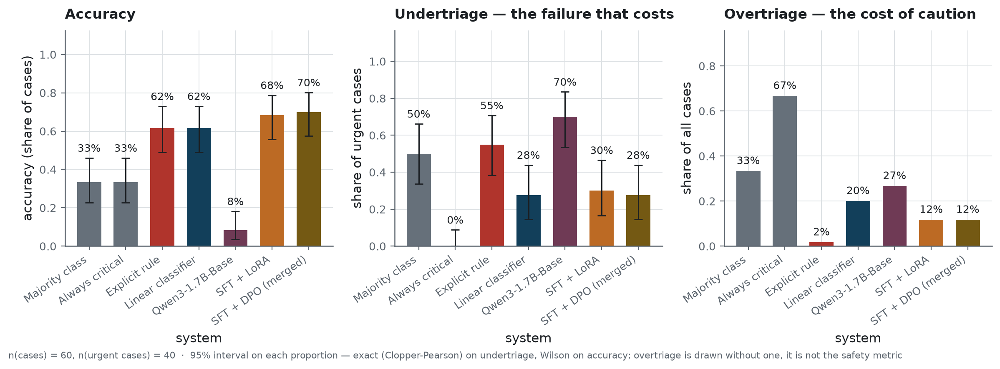
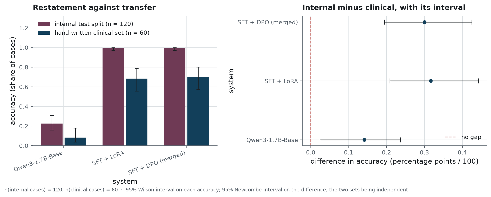
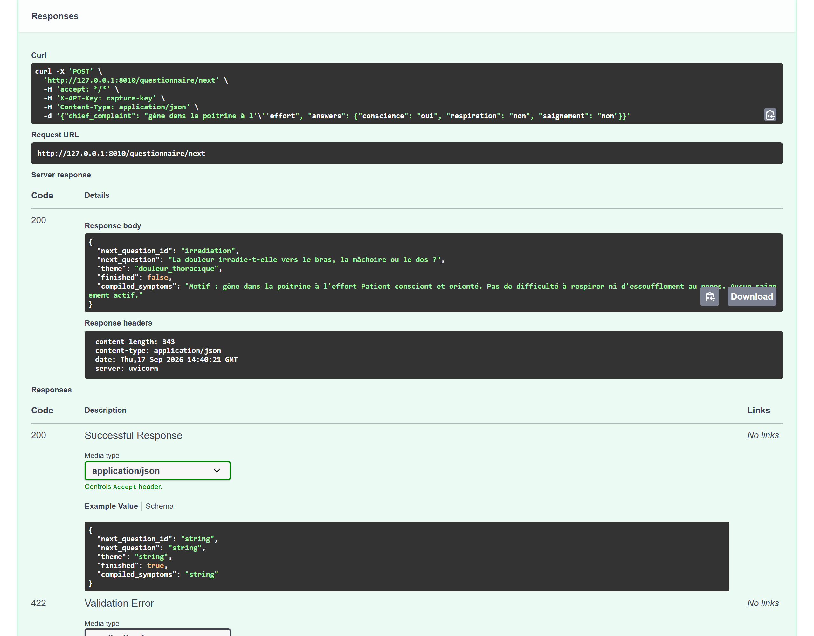

<h1 align="center">Emergency triage assistant</h1>

<p align="center">A small language model fine-tuned for emergency triage, that says when the explicit rule disagrees</p>

<p align="center">
  
  
  
  
</p>

**Project status** — finished, and stopped on purpose. The fine-tuning of the language model,
its preference alignment and the triage evaluation all ran on one RTX 4060 Ti in August 2026;
their artefacts are committed, and every number below names the file it comes from. No service is running behind this repository: the demonstration endpoint is a
command anyone can run, not an address kept alive. What the figures and the documents rest on is
`reports/run-evidence.json`, written by a run of `scripts/smoke.py` that redraws every published
figure from the committed results and refuses to write anything if one of them comes out
different. Pushes and pull requests still set the workflows off; the day this repository is
archived, they fall back to a manual trigger.

## The problem

A triage nurse decides, from a narrative and a couple of minutes, whether a patient is seen now,
within a few hours, or later. One of the two ways of being wrong costs a waiting-room place. The
other costs a patient, and it is the one this repository measures: **undertriage**, a patient
sent down the queue who should have gone up it.

A department can write a keyword rule in an afternoon, and that rule is the thing to beat. On the
sixty hand-written cases of this evaluation it misses more than half the urgent ones — it reads
words, and a chest pain described without the word "pain" is invisible to it. The question here
is whether a **large language model** small enough to serve on one card, **fine-tuned** on the
department's own vocabulary and then **preference-aligned**, does better than that rule; and
whether "better" survives the harder comparison, against an ordinary classifier trained on the
same pairs.

Asking the question honestly cost more than answering it. No public medical corpus is labelled
in triage levels, so the ground truth had to be built: a clinical catalogue written for the
project, a generator that draws vignettes from it, and four public corpora filtered down to the
cases that describe a patient. How, and what each source really yielded, is in
[`data/README.md`](data/README.md) and [`docs/data-source.md`](docs/data-source.md).

## What it does

Three routes, and the third is the point.

| Route | What it answers |
|---|---|
| `POST /questionnaire/next` | the next question to ask, chosen from the complaint; collection stops as soon as a vital sign appears |
| `POST /triage` | the triage level, why, what to do — **and what the explicit rule would have decided** |
| `GET /health` | whether the gateway and its inference engine are answering |

<!-- source: docs/images/MANIFEST.json -->


Hide that disagreement and the nurse reads a level without knowing that the rule, which never
hallucinates, would have sent the patient elsewhere. So `rule_level`, `rule_reasons` and
`agreement` travel in every reply, beside the model's own answer.



### How it is built

`Qwen3-1.7B-Base` is fine-tuned with LoRA on the project's bilingual set, on **PyTorch** under
Unsloth's kernels, then aligned on preference pairs that each carry one deliberate defect. Every
run writes to a local **MLflow** store, which is what makes the four LoRA settings comparable
after the fact rather than from memory. The ordinary baseline is a **scikit-learn** linear
classifier over n-grams, trained on the same pairs, and it is the demanding comparison.

Serving splits in two. A **FastAPI** gateway behind **Uvicorn** validates, runs the
questionnaire, applies the explicit rule, anonymises and logs; generation is delegated to vLLM
over its OpenAI-compatible route. Request and reply shapes are **Pydantic** models, which is why
the contract page above is generated rather than written. The gateway's **Docker** image carries
neither weights nor torch, so a new model version ships without rebuilding it.

Around all that: the environment is held to its lock file by **uv**, every push is read by
**Ruff** and by **Bandit**, and **pytest** works in three tiers — the last of which starts the
gateway in a process of its own and talks to it over the network. `datasets` keeps its cache in Arrow, and the **Parquet** reader is imported before
torch in the suite: on Windows the other order ends the process with an access violation.

## The result

Sixty cases written by hand, forty of them urgent, none of them seen during training and none
labelled by the rule that is compared against here.

<!-- source: reports/evaluation_results.json -->
| system | accuracy | undertriage | overtriage | format compliance |
|---|---|---|---|---|
| majority class | 0.333 | 0.500 | 0.333 | 1.000 |
| always critical | 0.333 | 0.000 | 0.667 | 1.000 |
| explicit rule | 0.617 | 0.550 | 0.017 | 1.000 |
| linear classifier | 0.617 | 0.275 | 0.200 | 1.000 |
| `Qwen3-1.7B-Base` | 0.083 | 0.700 | 0.267 | 0.367 |
| SFT + LoRA | 0.683 | 0.300 | 0.117 | 1.000 |
| SFT + DPO, merged | 0.700 | 0.275 | 0.117 | 1.000 |
n = 60 cases, of which n = 40 are urgent: undertriage is counted on those forty alone,
everything else on all sixty. What each column measures, and with which estimator, is in
[`metrics.yaml`](metrics.yaml).

<!-- source: reports/figures/MANIFEST.json -->


<!-- source: reports/evaluation_results.json -->
Against the rule it would replace, the shipped model halves the failure that matters, on the
n = 40 urgent cases of that set: **11** missed, against **22**. Read as a paired test on the
same cases, which is the only honest way to read two systems that saw the same patients, that
gap is **p = 0.019**.

<!-- source: reports/evaluation_results.json -->
Against the ordinary classifier it is a different story, and this is the finding the project
publishes rather than buries: on the same n = 40 urgent cases both miss **11**, and the
paired test gives **p = 1.0**. Four months of fine-tuning buy an answer a nurse can read and a format
the information system can parse — not a better triage decision than n-grams and a logistic
regression.

### What the model restates, and what it transfers

<!-- source: reports/figures/MANIFEST.json -->


<!-- source: reports/evaluation_results.json -->
On the internal test split, n = 120 cases, the model scores **1.000**. That number measures
restatement, not triage: every presentation in that split was seen during training under
another wording. The clinical set, n = 60, is the one that measures transfer, and the distance
between the two, **0.300**, is the size of the illusion a single-set evaluation would have
produced.

### The alignment did not transfer

<!-- source: reports/evaluation_results.json -->
On an external preference set of n = 150 pairs, the aligned model orders **0.353** of them
correctly, below chance, and the supervised model does the same. On the project's own pairs the
alignment works; asked to prefer the better of two answers it never saw in training, it has
learnt nothing transferable. Its benefit here is narrow and real, the format holds and the
undertriage moves, and the repository says where it stops.

## Why these numbers can be believed

The evaluation set was written by hand, case by case, with the clinical reason for each label
recorded beside it. It never passed through the triage rule, which is what makes the comparison
against that rule meaningful: on the corpus part of the training data the rule recovers its own
labels by construction, and measuring it there would measure the filter.

Every proportion carries an interval: Wilson for accuracy, exact for undertriage, where the
effectives are smallest. Every comparison between two systems is a paired test on the same cases,
never an overlap of two intervals, because overlap proves nothing and on paired data it is
systematically too cautious. The protocol, the estimators and what each of them can and cannot
support are in [`docs/protocol.md`](docs/protocol.md).

The figures are drawn from the committed result files by `scripts/build_figures.py`, and
[`reports/figures/MANIFEST.json`](reports/figures/MANIFEST.json) records for each one its
effective, its estimator and the digest of the image. Nothing in this README is typed by hand
from a number read elsewhere.

The method audit that closed this work found five defects, and the useful half of that result is
what it failed to find: no published figure moved. Four of the five were about how a measurement
gets written down. A count that was missing came out as `0`, so a report regenerated from a fresh
clone could read that the "0 distinct presentations it holds have all been seen in training". The
share of preference pairs clipped by the context window was typed into the report by hand while
the function that measures it only logged the value. The endpoint bench published
`"tokens_per_s": 0.0` for a gateway that counts no token at all. And the global accuracy built its
interval with Wilson directly, going around the single gate that picks the estimator from the
effective: on 60 and 120 cases the two paths agree, on a three-case subgroup they would not.

The fifth defect was the serious one. Four tests of the tracking module failed in the environment
continuous integration installs, because `describe_environment()` imported torch with no guard.
Those four tests are precisely the ones that exercise what the module promises, that tracking
never brings down a run.

Each correction was made where the defect lived. The count moved into `metadata.json`, which is
versioned, and reads `None` when it is absent, so the sentence loses its number. The clipped share
is written into the results file and read back from there. The throughput appears only when at
least one measurement carries a token count, the condition the gateway overhead already had. The
accuracy interval goes through `interval_for_proportion`. The environment description degrades to
`unavailable` when a library is missing. After that, the suite passes whole without the training
group, 0 failures, and the four tests exercise the path they describe.

## Running it

Requirements: [uv](https://docs.astral.sh/uv/) and Python 3.12. Training needs an NVIDIA GPU,
which Unsloth demands at import, and serving the model needs Docker.

```bash
uv sync
uv run clinical-triage          # what is configured, and what is present
uv run pytest                   # the three tiers
```

The pipeline, in order. The first two steps need the Hub, the next four a GPU:

```bash
uv run python scripts/build_dataset.py
uv run python scripts/tune_hyperparameters.py
uv run python scripts/train_sft.py
uv run python scripts/merge_adapter.py --adapter sft
uv run python scripts/train_dpo.py
uv run python scripts/merge_adapter.py --adapter dpo
uv run python scripts/run_evaluation.py
uv run python scripts/build_figures.py
```

The service, locally, with the engine beside it:

```bash
export TRIAGE_API_KEY="a-key-of-your-choosing"
docker compose -f infra/docker-compose.yml up --build
```

Everything the gateway reads is in [`.env.example`](.env.example); how it is deployed, and what
it costs, is in [`docs/operations.md`](docs/operations.md) and [`infra/README.md`](infra/README.md).

<!-- source: docs/images/MANIFEST.json -->


## Structure

```
.
├── src/clinical_triage/   # the package: config, prompts, data, training, evaluation, serving
├── scripts/               # the pipeline, one entry point per step
├── tests/                 # unit, integration, system
├── notebooks/             # the laboratory notebook, step by step
├── docs/                  # what is written for a reader, and the screenshots
├── reports/               # the results, the figures and their manifest
├── data/                  # what the programme consumes, and the data card
├── infra/                 # image, compose, deployment, model cards
└── var/                   # what a run produces, and nothing tracks
```

Where each decision lives, and what was rejected on the way, is in
[`docs/architecture.md`](docs/architecture.md). What changed between versions is in
[`CHANGELOG.md`](CHANGELOG.md).

## What this does not prove

The clinical catalogue behind the training data was written for this project and **has not been
validated by an emergency physician**. Nothing here should meet a patient.

Sixty cases is a small evaluation, and it shows: the interval on the shipped model's accuracy
spans a quarter of the scale. The comparison against the ordinary classifier is not close to
significant either way, so "the model is not better" is what the data supports, not "the model is
worse". One seed, one run: nothing here estimates what another seed would have given.

The alignment does not transfer beyond the pairs it was trained on, and the endpoint latency was
measured on one machine, one run, against one engine. The triage levels are those of the French
scale, and the questionnaire speaks French: the model is bilingual, the clinical vocabulary is
not.

## Licence and data

MIT — see [LICENSE](LICENSE).

The training set is built from four public medical corpora, each used under its own licence and
none redistributed here in its original form; the clinical vignettes and the evaluation cases
were written for this project. No real patient data is used. The masking, and the residue a
separate check still finds after it, are measured and published in the
[data card](data/README.md#gdpr-what-is-masked-and-what-is-checked).
