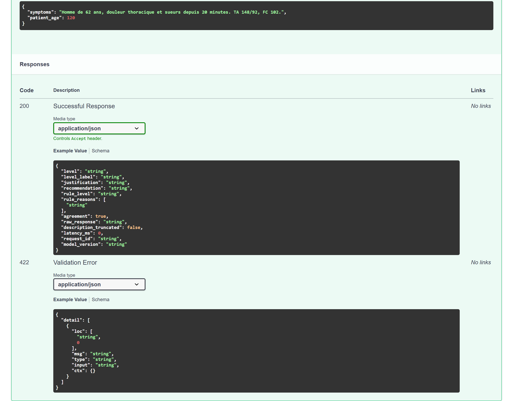

# Architecture

Six decisions hold this project up. Each of them closed a door, and the door is named here
beside the choice: an architecture document that only lists what was built explains nothing,
because every part of a system looks inevitable once it exists.

The reader this page expects is someone who has to maintain or extend the service, and who wants
to know which pieces are load-bearing before touching any of them.

## 1. The ground truth is written, not found

The obvious plan was to label a public medical corpus in triage levels and train on that. It
does not survive contact with the corpora: none of the four is annotated in levels, and only one
of them describes patients at all. The funnel in [`../data/README.md`](../data/README.md)
counts what each one really yields.

So the truth comes from a **clinical catalogue** written for the project — seventy presentations,
each carrying what a patient arrives with, what can be measured on them, and why that puts them
at that level — from which a generator draws vignettes. The public corpora contribute authentic
cases, filtered and labelled by an explicit rule, and carry an explicitly lower confidence that
travels with every example.

**What was rejected.** Labelling the corpora by prompting a larger model was considered and
dropped: the labels would have come from a system nobody can audit, and the project's whole
argument is that the ground truth is inspectable. Buying annotation was out of reach. Training on
the rule's own labels alone was rejected for the reason that runs through this document — a model
trained only on a rule's output learns the rule, including its blind spots, and the evaluation
would have measured the copy rather than the triage.

**What it costs.** The catalogue was not validated by an emergency physician. That is the
project's largest single limitation, it is stated in the README, and no amount of measurement
repairs it.

## 2. The explicit rule stays, and travels in the answer

A keyword rule was written first, to label the corpus cases. It could have been thrown away once
the model worked. It was kept, wired into the service, and published in every reply as
`rule_level`, `rule_reasons` and `agreement`.

The reason is not sentimental. The rule never hallucinates and never invents a level; the model
sometimes does. Where the two agree, the nurse has two independent reasons to trust the level.
Where they disagree, the screen can say so, and the human decides with the doubt in front of them
rather than behind them. Concealed, that doubt does not go away — it becomes a certainty nobody
checked.

**What was rejected.** Serving the rule as a fallback when the model fails — a silent switch —
was rejected: the caller would have no way of knowing which system answered. The rule's verdict
is published instead, always, and the caller decides what to do with it.

## 3. Two processes, not one

The service is a **FastAPI gateway** and a **vLLM engine**, in separate containers.

The gateway validates the request, runs the adaptive questionnaire, applies the explicit rule,
masks personal data, writes the audit line and shapes the reply. It holds no weights and does not
import torch: its image is a few hundred megabytes and starts in seconds. The engine holds the
model and answers one OpenAI-compatible route.

That split is what lets a new model version ship without rebuilding the gateway, and the gateway
ship without touching three gigabytes of weights. It is also what makes the on-demand deployment
possible: the engine scales to zero between demonstrations, the gateway stays up and answers the
health probe.

**What was rejected.** Serving with `transformers` inside the gateway — the shortest path, and
the one the project used first — was dropped when the image reached three gigabytes and the
process needed a GPU to answer a health check. The code for it is still there, behind
`TRIAGE_BACKEND=transformers`, because it is the only way to run the model without a container
runtime, and because an evaluation loop that does not go over HTTP is much faster.

## 4. LoRA on a small model, and the output head with it

The model is a 1.7-billion-parameter base model, fine-tuned with LoRA adapters rather than in
full. On one consumer card that is the difference between a run that finishes in an evening and
a run that does not start.

One thing had to be added to the usual recipe, and it is the project's least obvious finding. In
this base model the twenty-five ChatML control tokens are a single untrained vector — `im_start`
and `im_end` are identical to the third decimal by cosine similarity — and the output head is
tied to the embedding matrix, which LoRA freezes. The model therefore **cannot emit the
end-of-sequence token**: it runs to the generation cap on every answer. Training the output head
alongside the projections fixes it; clean stops go from none to all, and the answers shrink by
more than half. The measurement is in [`protocol.md`](protocol.md#the-end-of-sequence-token).

**What was rejected.** A larger base model would have removed the problem by having trained
control tokens, and was rejected on hardware: the project targets one card, and a model that
needs two says nothing about what a department could run. Full fine-tuning was rejected for the
same reason.

## 5. Preference alignment on defects, not on preferences

The alignment set is not a collection of human preferences. Each pair holds one answer that is
right and one that carries exactly one deliberate defect: an undertriage, an unsafe course of
action, a diagnosis asserted rather than suggested, or an answer in the wrong language. The
defect is named in the example, so what the alignment teaches can be read.

**What was rejected.** Using an external preference dataset as the training signal was rejected
after measuring it: on a sample of that set, more than a third of the pairs are ordered by answer
length alone. An alignment trained on it would have taught the model that longer is better. It is
used as an **evaluation** set instead, and the model does badly on it — which is reported rather
than hidden.

## 6. Everything a run produces lives under `var/`

Weights, audit log, experiment store: none of it is tracked, all of it is under one directory,
and the `.gitignore` holds one line for it. A repository where the ignore file has an exception
list is a repository where the layout stopped saying what a file is.

**What was rejected.** Keeping the model weights in the image, which would have made the
deployment a single artefact, was rejected: three gigabytes rebuilt on every gateway change, and
a model version that cannot be replaced without a new image. The engine reads the weights from
the Hub at a pinned revision instead, and the revision is what the deployment publishes.

## What runs where

<!-- source: docs/images/MANIFEST.json -->

| piece | where it runs | what it holds |
|---|---|---|
| gateway | container, no GPU | the questionnaire, the rule, the anonymisation, the audit log |
| engine | container with a GPU, or on demand | the merged model, at a pinned revision |
| training | one workstation with a GPU | nothing durable; it writes adapters and an MLflow store under `var/` |
| evaluation | the same workstation | the result files under `reports/`, which everything else reads |

The deployment itself — the two containers, the on-demand variant, and what each of them
costs — is in [`operations.md`](operations.md).
