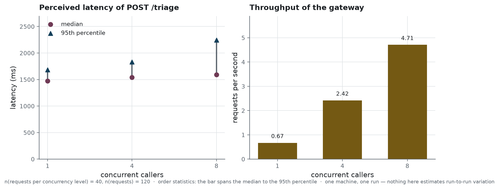

# Operations

What it takes to run the service, what it costs, how it fails, and what it leaves behind. The
deployment commands themselves are in [`../infra/README.md`](../infra/README.md); this page is
about running the thing once it is up.

The reader this page expects is whoever is on call for it.

## The two processes

The gateway answers HTTP and holds no model. The engine holds the model and answers one route.
They are separate containers, and that separation is what most of this page is about: almost
every failure is one of them being up while the other is not.

| process | what it needs | what happens without it |
|---|---|---|
| gateway | a service key, a writable audit log | refuses to start, and says which of the two is missing |
| engine | a GPU, the weights at a pinned revision | the gateway starts, answers the probe as degraded, and refuses every triage with 503 |

The gateway **refuses to start** without `TRIAGE_API_KEY`, unless open mode is asked for
explicitly. A check that disappears when its setting does is not a check at all, and refusing to
start is the only way to show that at deployment, before the first request.

It also opens the audit log at startup, empty, and refuses to serve if it cannot. Tracing every
interaction is one of this service's obligations, and answering without being able to write down
the answer breaks it. The case is not theoretical: a volume mounted from the host arrives owned
by root, and the service does not run as root.

## The health probe, and what it does not say

`GET /health` questions the engine rather than reporting on itself. It answers `ok` only when the
engine replies, `degraded` otherwise, and in the degraded case it says that the engine is not
answering — never where the engine is. The technical cause, which carries the engine's address,
goes to the log.

That matters on a managed host, where the engine's address is what protects it. The probe needs
neither key nor quota, so anything that reaches the gateway reaches the probe.

A consequence worth knowing when a container restarts: the gateway is up and healthy as a process
long before the probe turns green, because the engine takes minutes to load three gigabytes of
weights. The image's own health check gives it a grace period for exactly that.

## What one decision costs

<!-- source: reports/benchmark_endpoint.json -->

<!-- source: reports/benchmark_endpoint.json -->
One triage takes **1,473.5** milliseconds at the median with a single caller, n = 40 requests,
and **1,682.6** at the 95th percentile. The gateway's own share of that is **28.3** milliseconds:
validation, the questionnaire, the explicit rule, the anonymisation and the audit line together
cost under two hundredths of the answer. Everything else is generation.

<!-- source: reports/benchmark_endpoint.json -->
With eight concurrent callers, n = 40 requests each, the median moves to **1,592.0** milliseconds
and the throughput to **4.71** requests per second. The engine absorbs concurrency well; what
degrades is the tail, at **2,244.9** milliseconds for the 95th percentile.

These are order statistics on one machine, one run, against one engine version. They are not a
capacity plan, and the repository does not claim one.

## The quota

Every triage takes a GPU for a second and a half. An endpoint without a quota is an endpoint
anyone can saturate, so the gateway counts requests per caller over a sliding minute and answers
429 above the limit — announcing the limit in the message, so that an integrator does not have to
discover it by trial and error.

Two details that were defects first. The key counts as an identity **only where it was checked
against something**: open mode checks nothing, so a caller who changed the header at every
request used to be handed a fresh bucket each time. There, the address is the identity instead.
And callers that have gone quiet for a minute are dropped from the table, without which it grows
by one entry per address seen since startup — protection that ends up costing more than what it
protects.

The default is sixty a minute, which fits a reception desk. A load bench holds a single key and
passes that from its first concurrency level, so the compose file lets the value be raised for
the duration of a measurement without changing the service value.

## The audit log

One JSON line per interaction, appended, readable without a tool. It carries the request id, the
timestamp, the anonymised description, the level, the rule's level and reasons, the anonymised
answer, whether the description was truncated, the latency, the model that actually answered, the
engine, and the retention period in days.

Three things about it are not obvious.

**Both texts are masked, not just the incoming one.** The model's justification repeats what the
nurse wrote, so a name removed from the description would walk back in through the answer.

**The model version is read from what is loaded**, and passed at call time rather than taken from
a setting. A setting can name one model while another answers, and a trace that can say the wrong
thing is not a trace.

**The retention is written into every line**, so the obligation travels with the data and not
living in a document beside it.

In the container the log is a named volume. A host folder is mounted as root, and the service
runs unprivileged: every request then failed on the write, after having produced its decision.
`docker compose cp api:/app/var/logs/audit_triage.jsonl .` takes a copy out.

## When something is wrong

| symptom | what it means | what to do |
|---|---|---|
| the gateway exits at startup | no `TRIAGE_API_KEY`, or the audit log is not writable | the message names which; both are configuration, not code |
| `/health` says `degraded` | the engine is not answering | look at the engine's log; the gateway is fine and will recover on its own |
| every triage answers 503 | the same thing, seen from the caller's side | the caller is told to retry, and is told nothing about the engine |
| 401 on every call | the key presented does not match | the contract page names the header; the service compares in constant time |
| 429 under a bench | the quota, working | raise `TRIAGE_RATE_LIMIT` for the measurement, not for the service |
| answers cut mid-sentence | a description longer than the window | the reply says `description_truncated`; the bound is in characters, in the gateway |

The last one deserves its sentence. Cutting a patient's story without saying so is the one thing
a system of this kind must never do, so the gateway bounds the description, announces the bound
in its reply, and records it in the audit line. The bound is in characters because the gateway
carries no tokenizer, which is the point of a thin gateway, and the character figure is set from
the measured token budget.

## What is deployed, and what is not

The on-demand deployment raises the same pair: one container with a card, running vLLM over the
merged weights, and the gateway of the Docker image, unchanged. Nothing is rewritten, only rewired.
The engine shuts itself down after fifteen minutes of silence and wakes on the next request,
which is what keeps a demonstration from consuming a month of credit while nobody watches.

The engine gets a public address, like the gateway, and demands the service key. Without it,
finding that address would be enough to run generations on someone else's card — untraced,
unmasked, uncounted, and billed to them.

**No service is running behind this repository today.** The deployment is a command, described in
[`../infra/README.md`](../infra/README.md), not an address kept alive.
