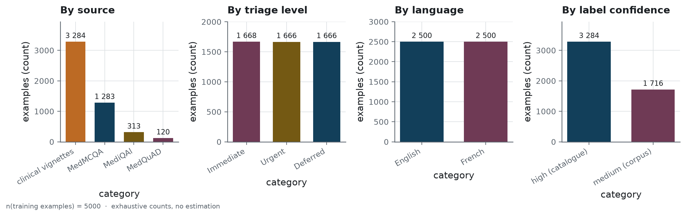
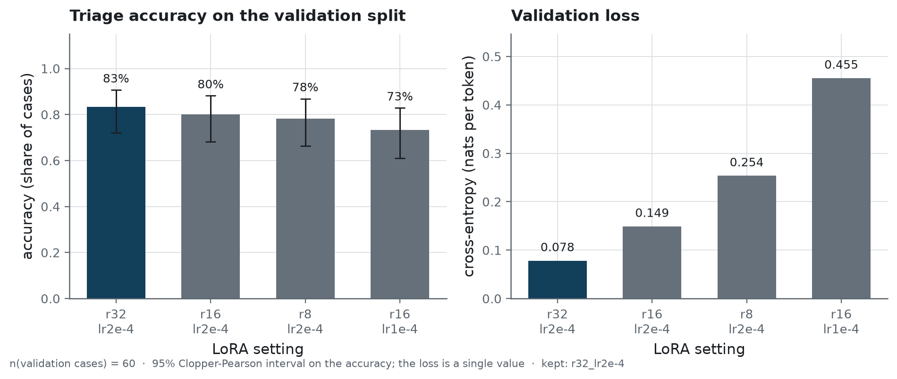
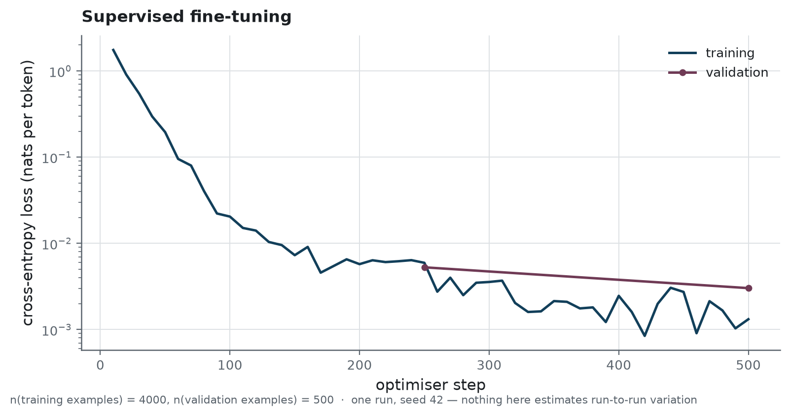
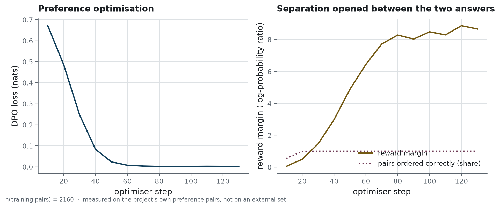
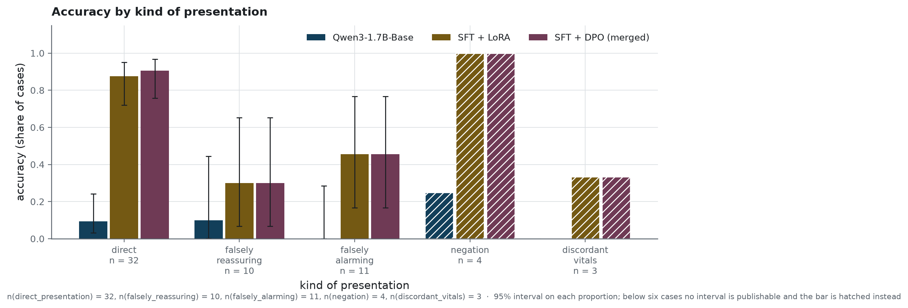
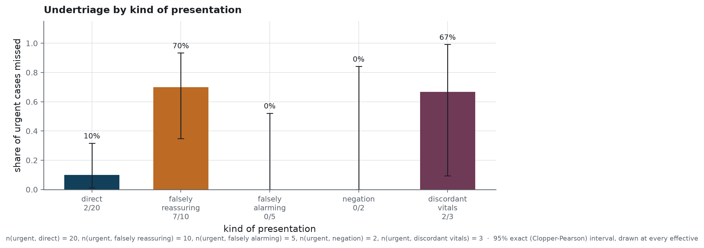
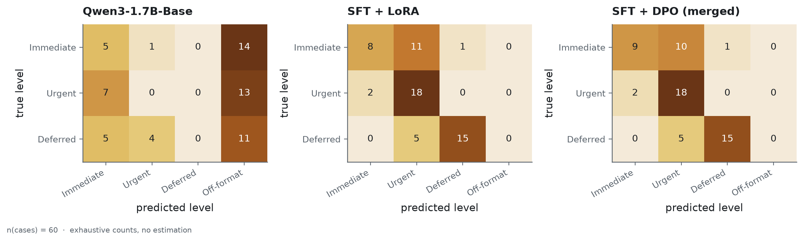

# Protocol

How the published numbers were produced, and what each of them can and cannot support. The
figures below are drawn by `scripts/build_figures.py` from the result files under `reports/`;
each carries its effective and its estimator in the image itself, and
[`../reports/figures/MANIFEST.json`](../reports/figures/MANIFEST.json) records what was drawn
from what.

The reader this page expects is someone who wants to check the claims rather than take them, and
who will look for the place where the protocol could have flattered itself.

## What is measured, on which population

Two evaluation sets, deliberately, because they answer different questions.

The **clinical set** is sixty cases written by hand, one at a time, each with the clinical reason
for its label recorded beside it. Forty of them are urgent. None was seen during training, and
the explicit rule never touched their labels — without which comparing the model to that rule
would prove nothing. Nearly half are written to mislead: a presentation that sounds reassuring and is
not, one that sounds alarming and is not, a negation, a vital sign that contradicts the
narrative.

The **internal test split** is a hundred and twenty cases held out of the training data, drawn by
the same generator from the same catalogue. Every presentation in it was seen during training
under another wording. It measures restatement, and it is published so that the distance between
the two sets can be read.

<!-- source: data/processed/metadata.json -->

The training corpus itself is balanced by construction across the three levels and the two
languages; where its cases come from, and what the public corpora really yielded, is in
[`data-source.md`](data-source.md).

## What was chosen, and on what

### The LoRA setting

Four settings were trained on the same twelve hundred examples, for the same seventy-five steps,
and judged on the validation split alone.

<!-- source: reports/training/hyperparameter_comparison.json -->

<!-- source: reports/training/hyperparameter_comparison.json -->
The setting kept is `r32_lr2e-4`, on n = 60 validation cases: **0.833** accuracy against
**0.733** for the weakest, and the lowest validation loss of the four at **0.0782**. It is also
the most expensive in memory, at **13.09** gigabytes of peak GPU memory — which is the real
constraint on one consumer card, and the reason the comparison was run at all.

Read with its interval, that ranking is not established: sixty cases separate 0.833 from 0.733 by
less than the width of either interval. What the comparison does establish is that no setting
collapses, and the loss ordering is consistent with the accuracy ordering. The choice was made on
the loss, which is measured on more than sixty numbers.

### The end-of-sequence token

The supervised run trains the output head alongside the LoRA projections, which is not the usual
recipe. It is there because of a property of this base model.

Its twenty-five ChatML control tokens share a single untrained vector: `im_start` and `im_end`
have a cosine similarity of 1.000 to the third decimal. The output head is tied to the embedding
matrix, and LoRA freezes both. Nothing in the adapters can therefore teach the model to close its
turn, and every answer runs to the generation cap. Adding the head to what is trained is what
repairs it: every answer then stops by itself, and the median falls from the cap of 220 tokens to
under a hundred.

<!-- source: reports/training/sft.json -->

<!-- source: reports/training/sft.json -->
The run trains **346,030,080** parameters of 2,377,769,984 — **14.553%** — which is what the
output head adds to the adapters. Over n = 4,000 training examples it takes **3,396** seconds on
one RTX 4060 Ti and never exceeds **7.43** gigabytes of GPU memory.

### The preference run

<!-- source: reports/training/dpo.json -->

<!-- source: reports/training/dpo.json -->
On its own validation pairs the alignment is complete: n = 240 pairs, **1.0** of them ordered
correctly, with a reward margin of **9.26**. That number measures the alignment against the
defects it was trained on, and nothing else. What it is worth on preferences it never saw is
further down this page, and the answer is nothing.

## How two systems are compared

Never by the overlap of two confidence intervals. Two systems evaluated on the same cases are
paired data, and on paired data the information lives entirely in the cases where they disagree:
comparing marginal intervals throws that away, and is systematically too cautious. Two intervals
that all but coincide can still sit either side of a real difference.

Every comparison in this repository is therefore an **exact McNemar test** on the same cases, and
what it reports is the count each way — how many cases the model saves that the baseline loses,
and the reverse. The counts are published beside the p-value, because they are what the p-value
is computed from and because they are readable on their own.

The same test, restricted to the urgent cases and to undertriage alone, is what separates the
model from the rule. Accuracy dilutes: a system can be wrong often without danger and rarely with
danger, and a triage tool is judged on the second.

## Which intervals, and why

| quantity | estimator | why this one |
|---|---|---|
| accuracy | 95% Wilson | well behaved away from the bounds, on sixty cases |
| undertriage | 95% exact, Clopper-Pearson | the effective is forty, and smaller by subgroup; the exact interval does not promise coverage it does not have |
| difference between two independent sets | 95% Newcombe | the internal and clinical sets are independent, so the difference needs its own interval rather than a subtraction of two |
| overtriage | none | not the safety metric; an interval on everything teaches the reader to ignore them |

The exact interval is checked against the closed-form beta quantile in the test suite: the
package computes its bound by bisection on the cumulative binomial rather than adding a
dependency, and the test verifies that the choice costs no precision.

## Where the model fails

<!-- source: reports/evaluation_results.json -->

<!-- source: reports/evaluation_results.json -->

<!-- source: reports/evaluation_results.json -->
On the cases that present straightforwardly, n = 32, the model reaches **0.9062** accuracy and
misses **2** of the twenty urgent ones. On the falsely reassuring cases, n = 10, it reaches
**0.3** and misses **7** of the ten urgent ones. That is the failure mode, and it is the one that
matters: a presentation written to sound benign is exactly what a triage desk sees on a bad day.

The subgroup effectives are small — three cases for discordant vitals, four for negation — and
the figures say so rather than drawing a rate on them: below six cases no interval is publishable
and the bar is hatched instead. What those subgroups support is "this is where to look next", not
a measurement.

<!-- source: reports/evaluation_results.json -->

<!-- source: reports/evaluation_results.json -->
The confusion matrices carry a column the triage scale does not have: **off-format**. An answer
nothing can parse predicts nothing, and putting it in a level would attribute to that level an
error it did not make. For the shipped model the column is empty; for the base model it holds
most of the answers.

<!-- source: reports/evaluation_results.json -->
Read by level, n = 20 cases each, the shape of the failure is plain: recall on the
life-threatening level is **0.45** while its precision is **0.8182**. The model is reluctant to
send a patient to the top level, and right when it does.

## What the alignment did not buy

The external preference set is a hundred and fifty pairs from a public dataset, never trained on.
It is used because an alignment that only improves on its own training distribution has not
improved anything a user will meet.

<!-- source: reports/evaluation_results.json -->
On those n = 150 pairs the aligned model orders **0.353** correctly and the supervised model
**0.36**: both below chance, and the paired test between them finds **0** pairs changed in either
direction. The alignment did not transfer.

That is worth stating plainly because the same alignment does move the clinical numbers: it
lowers undertriage and holds the format. Both are true at once, and the honest reading is narrow
— the defects it was trained on are the defects it learnt to avoid, and nothing generalises
beyond them.

## Robustness, and what it is not

<!-- source: reports/evaluation_results.json -->
Ten degraded inputs — an empty description, punctuation only, gibberish, a very long input, an
off-domain question, a prescription request, two prompt injections, a third language, and
identifying data — are sent to each model, and the answer is checked for format, language, clean
stop and the absence of an echoed prompt. The shipped model is compliant on **9** of the n = 10,
failing the French prompt injection alone.

Ten cases is a probe, not a measurement: it says the service does not fall over on inputs that
are not clinical narratives. A security evaluation of prompt injection is a different exercise,
and this repository has not done it.

## What the protocol cannot rule out

One training run, one seed, one card. Nothing here estimates what another seed would have given,
and the interval on accuracy covers the sampling of the sixty cases alone.

The evaluation set was written by the same person who wrote the catalogue. They share an author,
and therefore a way of describing a patient; a case written by a nurse would not look like these.
That is the limitation most likely to flatter the numbers, and no measurement in this repository
addresses it.

Against the ordinary classifier, nothing is established either way. Sixty cases support "the
model does not beat n-grams here"; they do not support "the model is worse".
