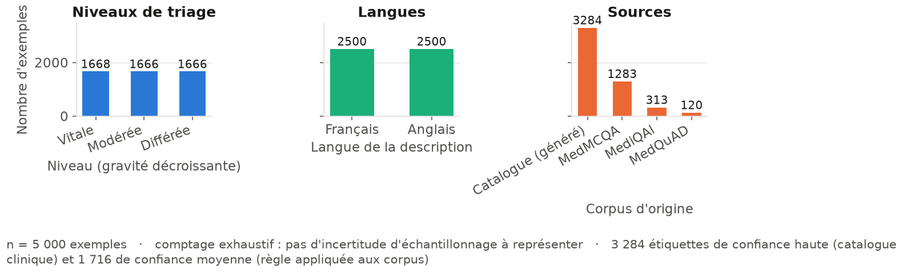
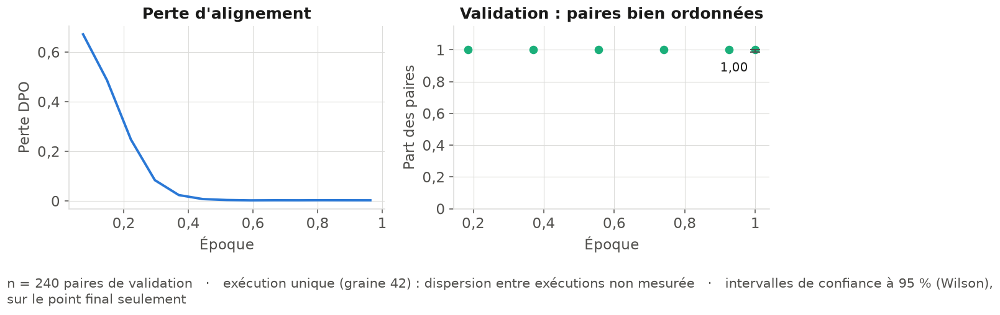
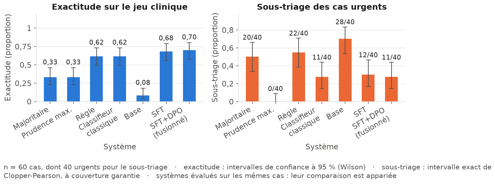
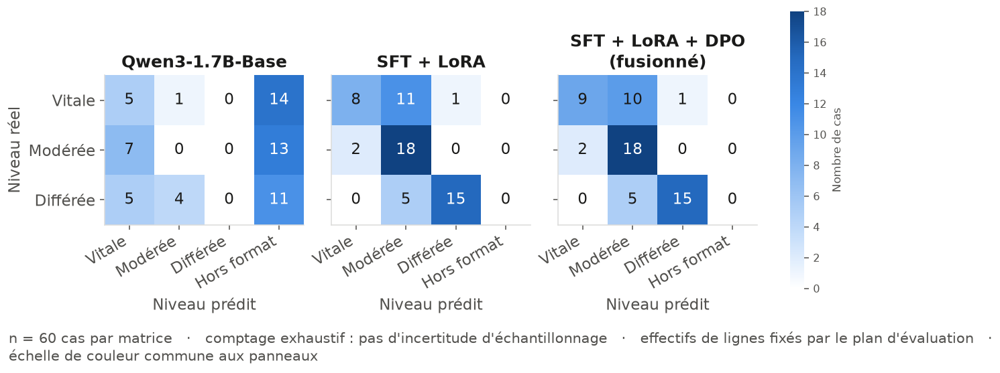
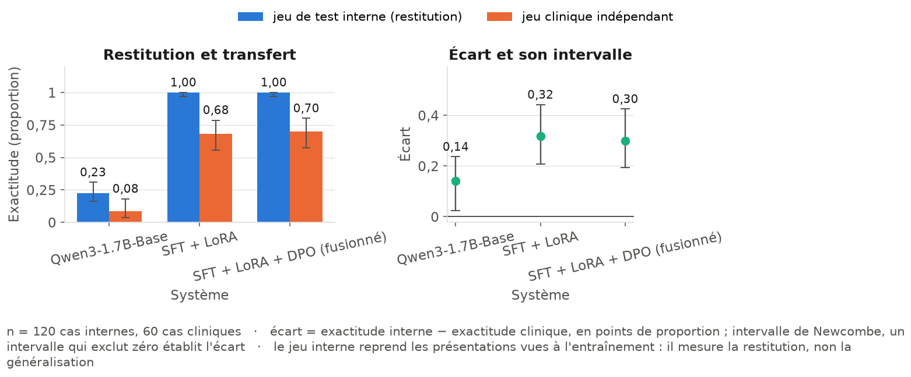
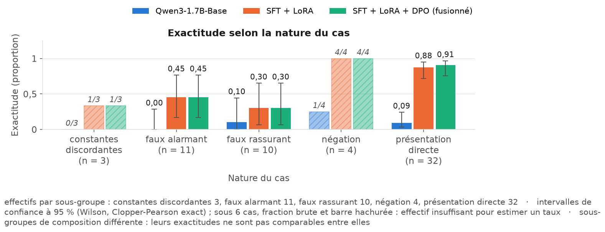

# Contexte et objectifs

Le service des urgences du Centre Hospitalier Saint-Aurélien connaît une surcharge
constante. Aux heures de pointe, l'accueil manque d'effectifs, les temps d'attente
s'allongent, et le risque est double : faire attendre un patient dont l'état se
dégrade, et mobiliser une place de déchocage pour un motif qui n'en relevait pas.

Ce projet livre le **prototype d'un agent d'aide au triage**. À partir d'une
description de patient — motif, symptômes, antécédents, constantes relevées à
l'accueil — il propose un **niveau de priorité**, le **justifie** et formule une
**conduite à tenir**, en traçant chaque interaction pour les audits médicaux.

L'agent ne décide pas. Il propose, explique, et rend visible son désaccord
éventuel avec la règle de triage explicite du service. La décision reste celle de
l'infirmière d'accueil.

L'essai randomisé de Goh *et al.* (*JAMA Network Open*, 2024, référence en
annexe B) rapporte qu'un modèle performant mis entre les mains de médecins n'a
pas amélioré significativement leur raisonnement, alors que le modèle **seul**
obtenait de meilleurs scores que les deux groupes de praticiens. La difficulté
est moins la performance brute que l'usage qu'en fait le soignant : d'où une
réponse toujours justifiée, l'avis de la règle affiché **à côté** de celui du
modèle, et le désaccord exposé plutôt que masqué.

## Périmètre et taxonomie

Trois niveaux, repris du cahier des charges — « urgence maximale / modérée /
différée » — et rattachés à l'échelle FRENCH utilisée dans les services
d'urgence français :

| Niveau | Délai de prise en charge | Échelle FRENCH |
|---|---|---|
| `URGENCE_VITALE` | immédiate | tris 1 et 2 |
| `URGENCE_MODEREE` | quelques heures | tris 3 et 4 |
| `CONSULTATION_DIFFEREE` | consultation programmée | tri 5 |

La stratégie du CHSA se déroule en trois phases. Ce rapport couvre les deux
premières : validation conceptuelle sur un modèle compact, puis spécialisation
par fine-tuning supervisé et alignement par préférences. La troisième — passage à
des modèles de plus grande envergure — fait l'objet de la feuille de route en
fin de document.

\pagebreak

# Données

## Ce que contiennent réellement les corpus imposés

Le cahier des charges désigne quatre corpus : MediQAl, FrenchMedMCQA, MedQuAD
et UltraMedical-Preference. Ce qu'ils permettent réellement de construire :

- **aucun de ces corpus n'est annoté en niveaux de triage.** Ce sont des jeux de
  questions-réponses médicales et de questions d'examen ;
- **MediQAl est le seul des quatre à décrire des patients.** Sa colonne
  `clinical_case` porte 3 075 vignettes françaises distinctes — motif,
  antécédents, et pour 569 d'entre elles les constantes relevées à l'entrée.
  C'est la seule source authentique francophone du corpus ;
- **FrenchMedMCQA compte 1 080 questions** sur ses trois découpages, dont six
  décrivent un patient et aucune n'est étiquetable. C'est un jeu de questions
  de pharmacie ;
- **MedQuAD interroge des pathologies, pas des patients.** Ses fiches de
  symptômes sont retournées en plaintes de patient, ce qui en tire quelques cas ;
- **UltraMedical-Preference étiquette 38,6 % de ses paires par la seule longueur
  de la réponse**, mesuré sur 5 000 lignes.

Un cinquième corpus, MedMCQA, a été ajouté hors cahier des charges : les trois
corpus exploitables qu'il désigne sont soit francophones, soit sans patient, et
la moitié anglophone du corpus authentique serait restée vide sans lui.

Les quatre corpus dont on tire des cas sont lus **intégralement** —
203 384 entrées. UltraMedical-Preference, le cinquième, est réservé à
l'évaluation. Le tableau ci-dessous dit où les entrées se perdent.

| Corpus | Entrées lues | Pas un patient | Hors bornes | Sans signe | Doublons | Extraits | Livrés |
|---|---|---|---|---|---|---|---|
| MediQAl | 3 075 | 1 407 | 514 | 792 | 0 | 362 | **313** |
| MedQuAD | 16 407 | 15 909 | 0 | 315 | 0 | 183 | **120** |
| MedMCQA | 182 822 | 171 251 | 372 | 9 038 | 71 | 2 090 | **1 283** |
| FrenchMedMCQA | 1 080 | 1 074 | 0 | 6 | 0 | 0 | **0** |

Deux de ces colonnes recouvrent des décisions de forme, révisables : le motif qui
reconnaît une présentation de patient, et les bornes de longueur, fixées de sorte
qu'aucun cas retenu ne dépasse le budget de description du service
(324 jetons). La troisième est une décision de sécurité : un
cas n'est conservé que si la règle y identifie explicitement un signe. Elle
écarte à elle seule 10 151 descriptions de patients authentiques, et rend
la classe « consultation différée » inatteignable depuis les corpus.

## Conception retenue

Le dataset livré repose sur trois apports, dans cet ordre d'importance.

**Un catalogue de présentations cliniques.** 70 présentations
types rencontrées à l'accueil des urgences, rédigées une par une : motif,
signes associés, antécédents plausibles, profil de constantes, et **niveau de
triage de référence**. Adulte, enfant, femme enceinte, traumatologie,
psychiatrie, et les motifs de médecine générale qui encombrent les urgences.

**Un générateur de vignettes.** Il habille une présentation d'un patient : âge,
sexe, antécédents tirés du catalogue, délai d'installation, relevé de constantes
cohérent avec la gravité, et formulation variable. L'étiquette vient de la
présentation d'origine, **jamais d'une relecture du texte produit** : aucune
règle lexicale n'a servi à étiqueter, le modèle ne peut donc pas se contenter
d'en réapprendre une.

**Des cas extraits des corpus publics.** Les vignettes de MediQAl, de MedMCQA et
les descriptions de symptômes de MedQuAD sont conservées après retrait de la
question d'examen, puis étiquetées par la règle explicite avec une **confiance
`moyenne`** qui les distingue des précédentes. La règle de sécurité décrite plus
haut s'applique ici : l'absence de signe ne prouve pas l'absence de gravité —
« suspected pneumoperitoneum » ne contient aucun mot d'alerte et reste une
urgence chirurgicale. La matière non urgente n'est donc pas étiquetable en
sécurité : sur les soixante cas cliniques, la règle reste muette dans 34 cas dont
14 sont urgents, soit une précision de 0,59 si l'on traitait son silence comme
une étiquette. Les cas non urgents viennent du catalogue, relus un par un.

## Dataset produit

| Jeu | Volume | Contenu |
|---|---|---|
| Entraînement supervisé | 4 000 | paires invite / réponse de triage |
| Validation | 500 | suivi de la convergence |
| Test interne | 500 | même distribution que l'entraînement |
| Préférences (DPO) | 2 400 | triplets invite / préférée / rejetée |
| Évaluation clinique | 60 | cas écrits à la main, jamais vus |



Le corpus est **équilibré** : 1 666 à 1 668 exemples par
niveau, 2 500 en français et 2 500 en anglais. 49 % des
exemples portent un relevé de constantes ; les autres n'en ont pas, parce qu'à
l'accueil le relevé n'est pas toujours disponible au moment du tri.

**Origine des exemples.** 3 284 des 5 000 paires (66 %) sont des vignettes générées à partir des 70 présentations du catalogue ; 1 716 (34 %) sont extraites des corpus publics — MediQAl 313, MedQuAD 120, MedMCQA 1 283, FrenchMedMCQA 0.

**Diversité des réponses attendues.** Les 3 284 vignettes ne portent que 70 réponses attendues distinctes — une par présentation d'origine — soit environ 47 répétitions chacune. Sur l'ensemble du jeu, on compte 305 réponses distinctes.

**Part du niveau lisible sur les métadonnées.** Un vote majoritaire sur les deux seules métadonnées du générateur — délai d'installation et profil de constantes — retrouve le niveau dans 89,6 % des vignettes, et 63,4 % d'entre elles tombent dans une combinaison qui ne va qu'avec un seul niveau.

Chaque exemple porte en outre les champs demandés par le cahier des charges :
symptômes, antécédents, constantes, source, **confiance de l'étiquette** — `haute`
pour le catalogue, `moyenne` pour la règle appliquée à un corpus — et présentation
d'origine. La liste exacte des colonnes des trois fichiers est dans la carte de
données publiée avec eux, sous la garde d'un test du dépôt.

## Conformité RGPD

Le principe premier est la **minimisation par conception** : aucune donnée
patient réelle n'entre dans le projet. Les vignettes sont synthétiques ; les
corpus publics sont des jeux de recherche sans donnée identifiante.

L'anonymisation Presidio est néanmoins appliquée aux textes issus des corpus, et
surtout au **journal d'audit du service** — le seul endroit du système où des
données patient réelles se déposeraient durablement une fois l'agent branché au
système d'information hospitalier.

Le réglage par défaut de Presidio s'est révélé inutilisable sur du texte médical.
Sur 400 exemples du corpus, chacun analysé dans sa langue, les entités
`DATE_TIME`, `LOCATION` et `NRP` masqueraient au moins un fragment de récit dans
**81 % des cas** :

- `DATE_TIME` emporte les **délais d'évolution** — « depuis trois semaines »,
  « cette nuit », « depuis deux heures » — et l'**âge** du patient ;
- `LOCATION` emporte `TA`, l'abréviation de la tension artérielle, à elle seule
  cent trente-six fois sur l'échantillon.

Délai, âge et constantes sont précisément les trois critères sur lesquels se
décide un niveau de triage. Trois décisions en découlent :

1. **seules les entités réellement identifiantes sont masquées** — nom, téléphone,
   adresse électronique, identifiants bancaires, adresse IP, numéro de sécurité
   sociale, date de naissance, URL. Quatre reconnaisseurs absents de Presidio
   ont été ajoutés et enregistrés dans les deux langues : le numéro de sécurité
   sociale, le téléphone au format national comme international, et la date de
   naissance en JJ/MM/AAAA comme en AAAA-MM-JJ ;
2. **le vocabulaire clinique du projet est protégé** : aucun terme du catalogue ni
   du lexique de triage ne peut être masqué. Cette protection porte sur les
   entités retenues, qui déraillent elles aussi sur du texte médical : sans elle,
   « inhibiteurs de recapture de la sérotonine » devient « inhibiteurs de
   recapture de la `<PERSON>` » ;
3. **le contrôle qualité est indépendant du détecteur.** Un jeu d'expressions
   régulières distinct, et non Presidio lui-même, cherche ce qui aurait pu
   passer : il relève 3 occurrences du motif « civilité suivie d'un nom ».

## Séparation des jeux

Le cahier des charges interdit de mélanger entraînement et évaluation. Cette
séparation est **vérifiée par le code** : le script de préparation échoue si un
tour utilisateur apparaît dans deux découpages, ou si un cas d'évaluation
clinique se retrouve à l'entraînement.
Mesure sur le dataset livré : test∩train = 0, test∩validation = 0, train∩validation = 0.

La déduplication porte sur le tour utilisateur complet et s'applique **après**
toutes les transformations de texte. Une version antérieure dédupliquait avant
l'anonymisation : le masquage rendait ensuite identiques des énoncés jusque-là
distincts, et ces doublons se répartissaient des deux côtés du découpage.

\pagebreak

# Entraînement

## Le format de dialogue

Le modèle de base ne sait pas dialoguer : il complète du texte. Le fine-tuning
lui apprend en même temps un format de dialogue et une tâche. Trois pièges de
format ont été rencontrés.

**Premier piège : le jeu de données exposait une colonne `messages`.** La
bibliothèque d'entraînement détecte cette colonne et re-sérialise les exemples
avec le gabarit de dialogue natif du modèle — celui de Qwen3, qui insère un bloc
`<think></think>` devant la réponse de l'assistant. Le modèle a donc appris un
format que l'inférence ne reproduisait jamais. Rien ne le signalait : les courbes
d'entraînement étaient normales.

**Deuxième piège : le jeton de fin de séquence était le mauvais.** Le tokenizer de
Qwen3-1.7B-Base sort d'usine avec `<|endoftext|>`, alors que le format appris se
termine par `<|im_end|>`. Le modèle ne disposait d'aucun jeton déclaré pour
signaler qu'il avait fini de répondre.

Les deux corrections tiennent en deux gestes : le projet **installe son propre
gabarit ChatML** sur le tokenizer et le sauvegarde avec le modèle, et **déclare
`<|im_end|>` comme fin de séquence**. Le jeu de données expose `prompt` et
`completion` plutôt que `messages`, ce qui a l'avantage supplémentaire de ne
calculer la perte que sur la réponse. Entraînement, alignement, évaluation et
service partent du même texte, au caractère près.

Le modèle ne s'arrêtait toujours pas.

### Troisième piège : un jeton que le modèle ne pouvait pas produire

Le réglage des hyperparamètres a rendu un résultat impossible : **0,000 d'arrêts
nets sur les quatre configurations**, à l'unité près, pendant que l'exactitude de
triage tournait autour de 0,85. Un modèle sous-entraîné produit un taux faible,
pas un zéro exact répété quatre fois.

*Les fichiers de résultats livrés ont été régénérés après correction :
les arrêts nets des quatre configurations vont de 0,983 à 1,000. La pièce qui établit le diagnostic est la comparaison des
modules adaptés, plus bas, où la configuration d'origine — les projections
seules — est rejouée à côté de la corrigée.*

Ni la mesure — sur un modèle jouet, l'arrêt sur le jeton de fin figure bien dans
la sortie — ni le budget de génération — 98 jetons en médiane pour un plafond de
220 — n'expliquent ce zéro. Restaient les poids du modèle de base :

- les vingt-cinq jetons ChatML (151644 à 151668) sont des vecteurs **identiques au
  bit près**, de norme 0,375 contre 1,62 pour la médiane du vocabulaire : des
  emplacements réservés, jamais entraînés ;
- `<|im_start|>` et `<|im_end|>` ont une **similarité cosinus de 1,000** ;
- le modèle **lie sa tête de sortie à ses embeddings** (`tie_word_embeddings`),
  que l'adaptation de rang faible gèle.

Le modèle ne pouvait donc pas émettre `<|im_end|>` de préférence à vingt-quatre
autres jetons : ils partagent une seule ligne de sortie, figée sur sa valeur
d'initialisation. Déclarer le jeton de fin disait au moteur quel jeton guetter,
sans rendre le modèle capable de le produire.
C'est un piège propre aux modèles **Base** : la variante Instruct a ces jetons
entraînés, et c'est elle qu'utilisent la plupart des recettes LoRA publiées.

**La correction : adapter la tête de sortie avec les projections.** Trois
configurations, protocole identique — 75 pas, 60 cas de validation :

| Configuration | Paramètres entraînés | Exactitude | Arrêts nets | Jetons générés |
|---|---|---|---|---|
| projections seules | 17 432 576 | 0,850 | 0,000 | 220 |
| projections + embeddings | 328 597 504 | 0,850 | 0,000 | 220 |
| **projections + tête de sortie** | 328 597 504 | **0,900** | **1,000** | **97** |

Entraîner les seuls embeddings ne sert à rien : la bibliothèque d'adaptation en
recopie le module, ce qui **rompt le lien** avec la tête de sortie — laquelle
reste gelée.

Le gain dépasse la conformité : en s'arrêtant, le modèle génère
97 jetons au lieu de 220 — **2,3 fois
moins de texte à produire** à chaque triage, donc autant de latence de service en
moins — et la consigne système cesse de déborder dans la réponse rendue au
soignant. La fusion exige en contrepartie de **découpler** la tête de sortie au
préalable.

## Fine-tuning supervisé avec LoRA, sous Unsloth

L'adaptation par matrices de rang faible n'entraîne que
346 030 080 paramètres sur 2 377 769 984, soit
14,55 % du modèle, ce qui fait tenir l'entraînement sur une carte de
16 Go.

L'entraînement passe par **Unsloth**, qui remplace les noyaux de calcul de
`transformers` par des versions écrites pour ce cas d'usage. L'écart a été mesuré
sur la même recette — même rang, mêmes modules adaptés, même lot effectif —
montée une fois sur Unsloth et une fois sur `transformers` + PEFT + TRL.

| Moteur | Mémoire GPU maximale | Secondes par pas |
|---|---|---|
| `transformers` + PEFT + TRL | 10,03 Go | 5,12 s |
| **Unsloth** | **7,23 Go** | 6,65 s |

Soit 28 % de mémoire en moins, 1,30 fois plus lent, sur 30 pas et à configuration identique.

Sur une carte de 16 Go partagée avec le système, la mémoire économisée prime sur
le temps perdu.

Unsloth traite par ailleurs la tête de sortie comme il faut : lui passer `lm_head`
parmi les modules adaptés le fait basculer en entraînement pleine matrice et gérer
le déliage des poids. Son correctif dédié aux jetons jamais entraînés,
`fix_untrained_tokens`, ne détecte en revanche que les lignes d'embedding
exactement nulles ; sur ce modèle, dont les jetons ChatML sont des vecteurs
dupliqués de norme 0,375, il reste sans effet. Le diagnostic décrit plus haut ne
pouvait donc pas être automatisé.

| Réglage | Valeur |
|---|---|
| Modèle de base | `Qwen/Qwen3-1.7B-Base` |
| Moteur d'entraînement | Unsloth (noyaux LoRA) sur TRL |
| Rang LoRA · alpha · dropout | 32 · 64 · 0,05 |
| Modules adaptés | projections d'attention et de perceptron, **et tête de sortie** |
| Taux d'apprentissage | 0,0002 |
| Époques · lot effectif | 2 · 16 |
| Longueur de séquence | 768 jetons |
| Précision · gradient checkpointing | bfloat16 · activé (variante Unsloth) |
| Graine | 42 |

Perte d'entraînement finale 0,0826, perte de validation
0,0030. Cet écart quasi nul ne prouve pas l'absence de
sur-apprentissage : le jeu de validation est fait de paraphrases des mêmes
présentations que l'entraînement, et une perte aussi basse mesure surtout la
restitution du gabarit de sortie. C'est le jeu clinique qui répond à la question ;
la courbe de convergence est en annexe du dossier de livrables.

## Réglage des hyperparamètres

Quatre configurations ont été comparées dans des conditions identiques — même
sous-ensemble, même graine, même nombre de pas — puis jugées sur deux critères :
la perte de validation, et l'**exactitude de triage** mesurée par génération. Les
deux ne vont pas toujours ensemble, et c'est la seconde qui compte pour le service.

| Variante | Paramètres entraînables | Perte de validation | Exactitude [IC 95 %] | Mémoire GPU |
|---|---|---|---|---|
| `r32_lr2e-4` | 346 030 080 | 0,0782 | 0,833 [0,72 – 0,91] | 13,1 Go |
| `r16_lr2e-4` | 328 597 504 | 0,1491 | 0,800 [0,68 – 0,88] | 12,4 Go |
| `r8_lr2e-4` | 319 881 216 | 0,2536 | 0,783 [0,66 – 0,87] | 7,1 Go |
| `r16_lr1e-4` | 328 597 504 | 0,4553 | 0,733 [0,61 – 0,83] | 13,6 Go |

**Les quatre variantes ne sont pas séparées par cette mesure.** Soixante cas de
validation donnent des intervalles qui se recouvrent tous : trois points d'écart,
ce sont deux cas. Rejouer la comparaison le confirme — l'ordre des deuxième et
troisième places change d'une exécution à l'autre, les noyaux GPU n'étant pas
déterministes au bit près.

Ce que la comparaison établit, c'est qu'**aucune des quatre configurations ne
dégrade le résultat**, et qu'elles tiennent toutes sur la carte de 16 Go. La
configuration retenue est **r32_lr2e-4**, la mieux placée sur cette
exécution ; trancher pour de bon demanderait un jeu de validation plus large.

La colonne mémoire ne compare pas les variantes : elles s'exécutent dans le
**même processus**, et le pic relevé hérite de ce que l'allocateur CUDA a déjà
réservé — deux variantes de rang identique diffèrent ici de plus d'un gigaoctet,
davantage que l'écart entre deux rangs successifs. Ces pics bornent le besoin
réel, ils ne l'attribuent pas au rang.

Le script de fine-tuning lit cette décision dans le fichier de comparaison, non
dans une constante recopiée. Le graphique correspondant est en annexe du dossier
de livrables.

### Suivi des exécutions : MLflow, auto-hébergé

Le cahier des charges laisse le choix entre MLflow et Weights & Biases. MLflow
est retenu parce qu'il s'auto-héberge : un service de suivi reçoit les noms
d'expériences, les hyperparamètres, les métriques et parfois des extraits de
données, et l'héberger dans l'établissement évite de désigner un sous-traitant au
sens de l'article 28 du RGPD. Chaque exécution est en outre résumée dans un
fichier JSON versionné sous `reports/training/`, lisible sans serveur.

## Alignement par préférences

Le fine-tuning apprend à répondre ; l'alignement apprend à **préférer**. Entre
deux réponses au même cas, on veut celle qui ne sous-évalue pas l'urgence, ne
retarde pas la prise en charge, n'affirme pas de diagnostic et respecte la langue
imposée.

**Origine des paires, et écart au cahier des charges.** Le cahier des charges
prévoit un entraînement DPO fondé sur les paires d'UltraMedical-Preference. Ce
corpus n'est pas utilisé ici pour l'entraînement : ses réponses sont de longues
dissertations en anglais, quand le contrat de sortie du triage tient en trois
lignes en français, et 38,6 % de ses paires sont étiquetées par la seule longueur
de la réponse. L'entraîner dessus apprendrait au modèle à violer le format qu'il
vient d'acquérir. Les 2 400 paires livrées sont donc construites à partir
du **seul jeu d'entraînement supervisé** : à chaque invite, la réponse de
référence est opposée à une variante dégradée selon l'une des quatre stratégies
du tableau ci-dessous. UltraMedical-Preference est réservé à l'évaluation, où il
sert de mesure d'alignement indépendante de nos données et de nos étiquettes.

Le modèle apprend la différence qu'il trouve entre les deux réponses. Une
première version opposait une bonne réponse de trois lignes à une réponse évasive
d'une demi-ligne ; la seule différence systématique étant la longueur, le modèle
a appris « plus long vaut mieux ». Trois règles encadrent donc le jeu livré :

1. **même format, même longueur.** Chaque défaut est décliné en plusieurs
   longueurs et l'on retient celle qui colle au plus près de la réponse préférée.
   Mesure sur le jeu livré : la réponse préférée est la plus longue dans
   44 % des paires — aucun signal de longueur exploitable ;
2. **jamais de surclassement en réponse rejetée.** La consigne système impose de
   surclasser au moindre doute ; opposer une réponse trop prudente comme mauvais
   exemple apprendrait exactement l'inverse ;
3. **les cas graves pèsent plus**, le sous-triage d'une urgence vitale étant la
   faute la plus coûteuse.

| Défaut introduit dans la réponse rejetée | Paires |
|---|---|
| Conduite à tenir qui retarde la prise en charge | 676 |
| Diagnostic présenté comme certain | 627 |
| Réponse hors de la langue imposée | 598 |
| Niveau sous-évalué | 499 |

Deux choix protègent l'acquis du fine-tuning. La **référence est le modèle
supervisé fusionné**, non le modèle de base : l'alignement ne peut donc pas
s'éloigner du format tout juste appris. Et une **perte supervisée sur la réponse
préférée** s'ajoute à la perte de préférence, qui seule n'optimise qu'un rapport
de vraisemblances — elle peut faire baisser la probabilité des deux réponses
pourvu que leur écart se creuse.

| Réglage | Valeur |
|---|---|
| Référence | modèle supervisé fusionné |
| Beta | 0,1 |
| Poids de la perte supervisée | 1,0 |
| Taux d'apprentissage | 0,000005 |
| Époques · lot effectif | 1 · 16 |



Sur le jeu de validation de préférences tenu à l'écart, le modèle aligné ordonne
correctement **100 %** des paires ; les courbes d'entraînement seules
ne distingueraient pas un alignement qui généralise d'un alignement qui apprend
par cœur.

\pagebreak

# Évaluation

## Protocole

Les chiffres publiés portent sur le **jeu clinique indépendant** :
60 cas écrits à la main, jamais vus à l'entraînement, dont les
étiquettes proviennent d'un raisonnement clinique et non de la règle à laquelle
le modèle est comparé. 47 % d'entre eux sont des **présentations
atypiques** :
urgence qui se donne l'air bénin, symptôme spectaculaire mais sans gravité, signe
grave explicitement nié, constantes qui contredisent le récit.

Quatre références encadrent les résultats :

- **classe majoritaire** — que donnerait un système répondant toujours la même
  chose ;
- **prudence maximale** — toujours l'urgence vitale. Ce système ne sous-trie
  jamais, et envoie tout le monde au déchocage. Il rappelle qu'on ne juge pas la
  sécurité sans regarder le coût de la prudence ;
- **règle explicite** — lexique bilingue de signes de gravité, gestion des formes
  fléchies et des négations, lecture des constantes dans le texte. C'est le
  système qu'un service peut déployer en un après-midi ;
- **classifieur classique** — n-grammes pondérés et séparateur linéaire,
  entraîné sur les mêmes paires que le modèle. Sa configuration est choisie sur
  le jeu de validation, sans que le jeu clinique soit consulté. C'est la
  référence qui dit ce que le fine-tuning apporte par-dessus un apprentissage
  ordinaire sur les mêmes données.

**Aucune estimation n'est publiée nue.** L'usage courant « moyenne ± erreur
type » ne convient pas ici : presque tout ce qui est mesuré est une proportion
sur quelques dizaines de cas, où l'approximation normale sort de l'intervalle
[0, 1] — deux sous-triages sur quarante cas urgents lui donnent une borne basse
négative — et annonce une certitude absolue dès qu'une proportion vaut 0 ou 1,
c'est-à-dire là où il ne faut surtout pas. Les règles tenues sont donc :

| Grandeur | Intervalle publié |
|---|---|
| Proportions, plus de trente cas | Wilson à 95 % |
| Proportions, six à trente cas | Clopper-Pearson exact, à couverture garantie |
| **Sous-triage**, quel que soit l'effectif | Clopper-Pearson exact — une couverture qui se dégrade n'est pas acceptable sur la métrique de sécurité |
| Moins de six cas, **hors sous-triage** | aucun : la fraction brute, et la mention « effectif insuffisant » |
| Écart entre deux systèmes sur les **mêmes** cas | McNemar exact, sur les seuls cas discordants |
| Écart entre deux jeux **indépendants** | intervalle de Newcombe sur la différence |
| Comptages exhaustifs du corpus | aucun : ils sont dénombrés, pas estimés |
| Marge moyenne sur les préférences | aucun : la dispersion par paire n'est pas conservée ; la colonne se lit avec la part de paires bien ordonnées, qui porte l'intervalle |
| Latences | centiles par rang le plus proche, jamais une moyenne : la distribution est à queue lourde, et le chiffre publié est une latence réellement mesurée |

Deux conséquences. Sur 60 cas, un écart de trois points n'est pas un
écart. Et **le recouvrement de deux intervalles ne prouve rien** : seul le
non-recouvrement établit une différence. Les comparaisons se lisent donc sur un
test apparié ou sur l'intervalle de l'écart, jamais sur deux moustaches côte à
côte. Dernière réserve : ce rapport publie
plusieurs dizaines d'intervalles à 95 %, et un ou deux manqueront leur cible par
le seul jeu du hasard. Aucune correction de multiplicité n'est appliquée, ces
intervalles décrivant des mesures et non une famille d'hypothèses.

## Résultats

Les deux taux de faute ne se rapportent pas à la même population, et c'est
délibéré. Le **sous-triage** se compte parmi les seuls cas réellement urgents —
vitaux ou modérés : rapporté à l'ensemble, il serait mécaniquement dilué par les
consultations différées, où il ne peut pas se produire. Le **surclassement** se
compte sur l'ensemble des cas, parce qu'il mesure une charge de service : ce qui
intéresse un chef de service, c'est la proportion de patients présentés qui
arriveront un cran trop haut.

Le respect du format se lit avec les deux : une réponse illisible sur un cas non
urgent n'entre dans aucun des deux taux de faute, et un système muet afficherait
0 % de surclassement, le meilleur score possible de la colonne.

| Système | Exactitude [IC 95 %] | Sous-triage, cas urgents [IC 95 %] | Respect du format [IC 95 %] | Surclassement, tous cas [IC 95 %] |
|---|---|---|---|---|
| Classe majoritaire | 0,333 [0,23 – 0,46] | 50 % [34 % – 66 %] | 100 % [94 % – 100 %] | 33,3 % [22,7 % – 45,9 %] |
| Prudence maximale | 0,333 [0,23 – 0,46] | 0 % [0 % – 9 %] | 100 % [94 % – 100 %] | 66,7 % [54,1 % – 77,3 %] |
| Règle explicite | 0,617 [0,49 – 0,73] | 55 % [38 % – 71 %] | 100 % [94 % – 100 %] | 1,7 % [0,3 % – 8,9 %] |
| Classifieur classique | 0,617 [0,49 – 0,73] | 27,5 % [15 % – 44 %] | 100 % [94 % – 100 %] | 20 % [11,8 % – 31,8 %] |
| Qwen3-1.7B-Base | 0,083 [0,04 – 0,18] | 70 % [53 % – 83 %] | 36,7 % [25,6 % – 49,3 %] | 26,7 % [17,1 % – 39 %] |
| SFT + LoRA | 0,683 [0,56 – 0,79] | 30 % [17 % – 47 %] | 100 % [94 % – 100 %] | 11,7 % [5,8 % – 22,2 %] |
| SFT + LoRA + DPO (adaptateur) | 0,700 [0,57 – 0,80] | 27,5 % [15 % – 44 %] | 100 % [94 % – 100 %] | 11,7 % [5,8 % – 22,2 %] |
| SFT + LoRA + DPO (fusionné) | 0,700 [0,57 – 0,80] | 27,5 % [15 % – 44 %] | 100 % [94 % – 100 %] | 11,7 % [5,8 % – 22,2 %] |



La classe majoritaire atteint 0,33 et la prudence maximale 0,33 — cette dernière ne sous-trie jamais, au prix de 66,7 % de surclassement, c'est-à-dire d'un service saturé. La règle explicite atteint 0,62 avec 55 % de sous-triage.

Le modèle fine-tuné et aligné atteint 0,70 [0,57 – 0,80] avec 27,5 % de sous-triage et 100 % de réponses exploitables par le système d'information. **Sur le sous-triage, la mesure qui décide**, le modèle laisse passer 11 cas urgents sur 40 là où la règle en laisse passer 22. Les deux systèmes voient les mêmes cas : 15 urgences que seul le modèle attrape contre 4 que seule la règle attrape, soit un écart établi (McNemar exact, p = 0,019). Sur l'exactitude globale, le modèle dépasse la règle de 8 points, mais cet écart-là n'est pas établi sur un jeu de cette taille (14 cas contre 9, p = 0,405).

Le classifieur classique — configuration `mots_bigrammes`, mêmes 4 000 paires d'entraînement — atteint 0,62 avec 27,5 % de sous-triage et 20 % de surclassement, contre 11,7 % pour le modèle. Sur les mêmes cas, le modèle en corrige 9 que le classifieur manque et en manque 4 qu'il corrige (McNemar exact, p = 0,267). Sur le sous-triage, les deux systèmes sont à égalité — 11 urgences manquées sur 40 de part et d'autre, 3 cas rattrapés contre 3 perdus (p = 1,000). Ce classifieur ne produit que le niveau : la justification et la recommandation, deux des trois champs du contrat de sortie, restent hors de sa portée.

Le modèle de base, non spécialisé, ne rend une décision exploitable que dans 36,7 % des cas, pour 0,08 d'exactitude : c'est la mesure de ce qu'apporte la spécialisation.



## Ce qui est appris et ce qui se transfère

Le modèle a aussi été évalué sur le **jeu de test interne** : même assemblage que
l'entraînement, des cas mis de côté avant d'entraîner. Le découpage tire des
**lignes**, pas des présentations : les 66 présentations
distinctes qu'il contient ont **toutes** été
vues à l'entraînement, sous une autre formulation. Ce jeu mesure donc la
**restitution** de paraphrases de cas connus — un plafond, pas un transfert — et
ses observations, n'étant pas indépendantes, rendent son intervalle optimiste.

L'ampleur de cette restitution se mesure sans le modèle : une sonde linéaire sur
n-grammes atteint 0,988 sur les vignettes en découpage
aléatoire et 0,773 en découpage par présentation d'origine.
Les 22 points qui séparent ces deux chiffres sont la part de
reconnaissance de cas déjà vus que contient tout résultat calculé sur ce jeu.

La règle explicite n'est pas reprise ici : ayant servi à filtrer le corpus, elle
y retrouve l'étiquette par construction, et la comparer mesurerait ce filtre.
Elle garde tout son sens sur le jeu clinique, écrit à la main sans jamais passer
par elle. Le classifieur classique, lui, est évalué sur les deux jeux : il
apprend des mêmes paires que le modèle et n'a pas vu les cas qu'il juge.



Le modèle atteint 1,00 [0,97 – 1,00] sur le jeu de test interne et 0,70 [0,57 – 0,80] sur le jeu clinique indépendant, soit 30 points d'écart. L'écart est important : une part de la performance interne tient à la régularité des gabarits de génération, que les cas rédigés à la main ne présentent pas. C'est l'argument le plus fort en faveur d'un corpus d'entraînement issu du terrain.

## Performance selon la nature du cas



Sur les présentations directes, le modèle atteint 0,91 [0,76 – 0,97]. Sur les 28 présentations atypiques prises ensemble, il retombe à 0,46 [0,28 – 0,66]. Sa pire catégorie est « faux rassurant », 0,30 [0,07 – 0,65] sur 10 cas — un effectif qui situe une faiblesse sans la quantifier. C'est le résultat attendu, et c'est celui qui compte : les présentations atypiques sont précisément celles où un tri automatique peut nuire.

## Contrôles de sécurité

Le niveau de triage ne dit pas tout : une réponse peut annoncer « urgence vitale »
et recommander de revenir demain, ou altérer une constante qu'on lui a donnée.
**Six contrôles** sont appliqués à chaque réponse produite, et le tableau
ci-dessous en ajoute la synthèse — la part de réponses qui n'en déclenchent aucun.

| Contrôle | Modèle final [IC 95 %] |
|---|---|
| Réponses sans aucun défaut | 96,7 % [88,6 % – 99,1 %] |
| Recommandation incohérente avec le niveau | 1,7 % [0,3 % – 8,9 %] |
| Diagnostic affirmé (interdit par la consigne) | 0 % [0 % – 6 %] |
| Réponse hors de la langue imposée | 0 % [0 % – 6 %] |
| Constante citée mais absente du cas | 1,7 % [0,3 % – 8,9 %] |
| Structure de réponse incomplète | 0 % [0 % – 6 %] |
| Niveau annoncé hors de la taxonomie | 0 % [0 % – 6 %] |

Ces contrôles sont des règles lisibles, pas un second modèle. C'est un choix : en
contexte médical, un contrôle de sécurité doit pouvoir être relu, discuté et
corrigé par une équipe soignante.

**Un contrôle de sécurité doit lui-même être contrôlé.** Les 70
réponses de référence du catalogue sont conformes par construction : les passer
au contrôle doit donc ne rien signaler. Ce test a d'abord échoué sur dix d'entre
elles, toutes des urgences vitales, pour une raison invisible à la lecture du
code : la lecture d'une réponse retire les accents afin de tolérer les fautes
d'orthographe du modèle, tandis que les motifs de sécurité étaient écrits avec
leurs accents. Ils ne pouvaient jamais correspondre, et le rapport aurait publié
un taux d'incohérence entièrement fabriqué — **contre** le modèle.

Ce test de non-régression fait désormais partie de la suite automatisée.

## Robustesse aux entrées dégradées

Un service d'accueil ne reçoit pas que des cas bien formés. Dix entrées dégradées
sont soumises au modèle : saisie de trois lettres, ponctuation seule,
copier-coller de deux pages, question hors domaine, demande de prescription,
consigne détournée en français puis en anglais, description en langue tierce et
saisie contenant des données identifiantes. Ce qui est vérifié, c'est que l'agent
**tient son contrat**, jusqu'au renvoi de données identifiantes : un numéro de
téléphone n'a rien à faire dans une justification de triage. Une seule de ces
entrées appelle en plus un niveau précis, et le contrôle l'exige : la description
en langue tierce décrit une douleur thoracique de vingt minutes avec sueurs, et
un triage différé y serait dangereux, si bien formé soit-il.

| Contrôle | Modèle final [IC 95 %] |
|---|---|
| Entrées dégradées traitées sans écart au contrat | 90 % [55,5 % – 99,8 %] |
| Réponse au format attendu | 90 % [55,5 % – 99,8 %] |
| Consigne système non divulguée | 100 % [69,2 % – 100 %] |
| Réponse dans la langue imposée | 100 % [69,2 % – 100 %] |
| Génération arrêtée par le modèle lui-même | 100 % [69,2 % – 100 %] |
| Données identifiantes non renvoyées dans la réponse | 100 % [69,2 % – 100 %] |
| Niveau jamais en contradiction avec l'entrée | 100 % [69,2 % – 100 %] |

L'entrée « copier-coller de deux pages » produit 825 jetons pour une fenêtre de
768 : la génération s'interrompait sur une erreur, et le contrat d'API acceptait
alors quatre mille caractères. Les descriptions sont désormais bornées et **la
coupe est annoncée** dans la réponse comme au journal.

1 des 10 entrées dégradées produit une réponse qui s'écarte du contrat de sortie : consigne détournée. Le filet de troncature du service garantit que la consigne système n'atteint jamais le personnel soignant, mais ces cas doivent être repris avant tout usage réel.

## Apport mesurable de l'alignement

Sur trois classes, deux modèles proches produisent souvent les mêmes décisions :
l'écart entre le modèle supervisé et le modèle aligné se noie dans l'incertitude
du jeu clinique. On mesure donc l'alignement là où il s'exprime — **sur des
préférences**.

Pour chaque paire de réponses annotée par des humains, on compare la
vraisemblance que le modèle attribue à la réponse préférée et à la réponse
rejetée, normalisée par la longueur. Le jeu utilisé est
**UltraMedical-Preference**, corpus de préférences médicales du cahier des
charges, tenu hors de l'entraînement pour les raisons exposées plus haut : la
mesure ne dépend ni de nos données ni de nos étiquettes. Les paires annotées sur
la seule longueur de la réponse sont écartées :
elles mesureraient la verbosité.

| Modèle | Paires bien ordonnées [IC 95 %] | Marge moyenne |
|---|---|---|
| Qwen3-1.7B-Base | 34,7 % [27,5 % – 42,6 %] | -0,0797 |
| SFT + LoRA | 36 % [28,8 % – 43,9 %] | -0,1063 |
| SFT + LoRA + DPO (adaptateur) | 36 % [28,8 % – 43,9 %] | -0,1066 |
| SFT + LoRA + DPO (fusionné) | 35,3 % [28,1 % – 43,3 %] | -0,1074 |

Sur les 150 paires du jeu externe, le modèle supervisé en ordonne correctement 36 %, le modèle aligné 36 %. **Ces valeurs sont sous le hasard**, qui vaut 50 % sur des paires à deux réponses. Le modèle de base, que notre entraînement n'a pas touché, est au même niveau (34,7 %) : le phénomène précède le fine-tuning et ne le décrit pas. L'explication la plus simple est que l'instrument ne s'applique pas à ce modèle : on compare des vraisemblances par jeton attribuées à de longues dissertations anglaises par un modèle spécialisé sur des réponses françaises courtes et structurées, dont 15 % dépassent en outre sa fenêtre et sont écrêtées. Une évaluation externe de l'alignement reste à construire — sur des préférences de même format que la tâche, c'est la leçon à retenir. Les deux modèles s'accordent sur 150 paires, l'alignement en gagne 0 et en perd 0 : le test de McNemar ne conclut pas (p = 1,000).

## Analyse d'erreurs

Sur 60 cas, 18 restent mal classés, dont 11 par sous-évaluation — les seules qui présentent un risque pour le patient. Trois cas en détail, sous-triages d'abord :

| Cas | Attendu | Prédit | Nature | Description |
|---|---|---|---|---|
| `ev04` | urgence vitale | urgence moderee | directe | Patiente de 31 ans, enceinte de 34 semaines, se plaint depuis ce matin de céphalées qui ne cèdent pas, de points lumineux devant les yeux et d'une bar… |
| `ev09` | urgence vitale | urgence moderee | directe | A 58-year-old man had a sudden tearing pain in the abdomen radiating to his back while gardening. He nearly fainted. He is known to have an aortic ane… |
| `ev11` | urgence vitale | urgence moderee | faux rassurant | Femme de 71 ans, diabétique de longue date, se dit seulement « très fatiguée » depuis deux heures, avec une vague nausée et un essoufflement inhabitue… |

\pagebreak

# Infrastructure et performance

## Architecture de service

```
poste d'accueil / SIH  ──HTTPS──▶  passerelle FastAPI  ──HTTP──▶  serveur vLLM (GPU)
                                   authentification              modèle fusionné
                                   questionnaire adaptatif       traitement par lots
                                   règle de contrôle             cache d'attention
                                   anonymisation et audit
```

La séparation est délibérée. La passerelle est légère — ni torch, ni poids de
modèle — et se redéploie en quelques secondes sans toucher au modèle ; le serveur
d'inférence se met à jour sans toucher à la logique métier. Le contrat OpenAPI
rend l'intégration au système d'information indépendante des deux.

Trois points d'entrée : la sonde de santé, le **questionnaire adaptatif** —
les questions posées dépendent du motif, et la collecte s'arrête dès qu'un signe
de détresse vitale apparaît — et le **triage**, qui renvoie le niveau, sa
justification, la conduite à tenir, et **le niveau qu'aurait retenu la règle
explicite**. Quand les deux divergent, l'interface d'accueil le signale.

Le questionnaire compile ses réponses en **phrases**, et non en questions suivies
de leur réponse. La description produite est relue par la règle explicite, et
« Y a-t-il une difficulté à respirer ? non » y est lu comme une difficulté à
respirer : un rhume dont le patient a tout nié ressortait classé urgence vitale,
avec ce signe en justification. Écrire « Pas de difficulté à respirer » — une négation que la
règle sait traiter — règle le problème, et donne au modèle un texte qui ressemble
à ce qu'un soignant écrirait.

## Livrer un adaptateur ou un modèle fusionné ?

Un fine-tuning LoRA produit deux objets livrables : l'**adaptateur** seul, qui
s'applique à chaud sur un modèle de base, et le **modèle fusionné**, où
l'adaptation est intégrée aux poids. Les deux portent le même apprentissage à
l'arrondi près. Les deux ont été évalués côte à côte, sur le même jeu clinique.

| | Adaptateur | Modèle fusionné |
|---|---|---|
| Exactitude sur le jeu clinique | 0,700 [0,57 – 0,80] | 0,700 [0,57 – 0,80] |
| Latence médiane | 796 ms | 433 ms |
| Poids à télécharger | 67 Mo | 3,78 Go |
| Modèle de base requis | `qwen3-1.7b-triage-sft-merged` | aucun |
| Servable à chaud par vLLM | oui, sur le modèle supervisé fusionné | oui, seul |

Accord entre les deux jeux de prédictions : **100 %**. Les écarts
résiduels sont du bruit numérique attendu — la fusion additionne un delta en
simple précision avant de repasser en bfloat16, et l'ordre d'accumulation diffère.
Un écart de plusieurs points aurait signalé une fusion défectueuse, pas du bruit.

Les deux livraisons sont **indiscernables en précision** : l'écart observé vaut moins d'un cas sur 60. Le choix se joue donc entièrement sur des critères d'exploitation.

Servir l'adaptateur à chaud suppose que le serveur héberge le modèle supervisé
fusionné — c'est au-dessus de lui que l'alignement a été entraîné — puis lui
applique l'adaptateur : vLLM le
fait, mais cela fait deux artefacts à apparier, une révision de plus à épingler, et
une occasion de plus de servir le mauvais modèle de base. L'adaptateur reste utile
à l'évaluation et à l'itération, où il évite de réexporter plusieurs gigaoctets ;
**c'est le modèle fusionné qui est livré et servi.** L'adaptateur supervisé, lui,
n'est pas servable à chaud du tout — il entraîne la tête de sortie en entier, que
le serveur refuse —, ce qui est le prix de la correction du jeton de fin et une
raison de plus de livrer un modèle fusionné.

## Latence et débit

Les mesures portent sur `POST /triage`, c'est-à-dire sur ce que l'infirmière
d'accueil appelle : la passerelle interroge le moteur, puis applique la règle
explicite, anonymise la description et la réponse, et écrit au journal d'audit
avant de répondre. Ce travail-là compte dans le temps d'attente, et le critère de
passage en production porte sur le total, pas sur la seule génération.

| Requêtes simultanées | Latence médiane | 95ᵉ centile | Débit |
|---|---|---|---|
| 1 | 1474 ms | 1683 ms | 0,67 req/s |
| 4 | 1542 ms | 1830 ms | 2,42 req/s |
| 8 | 1592 ms | 2245 ms | 4,71 req/s |

À une requête à la fois, la latence médiane est de 1474 ms et le 95ᵉ centile de 1683 ms. C'est l'ordre de grandeur d'une interaction à l'accueil : le temps de saisie du motif suivant. Sur ce total, 28 ms reviennent à la passerelle elle-même, et le reste à la génération. Sous charge, le débit passe à 4,7 requêtes par seconde, soit 7,0 fois celui d'une requête à la fois, et le 95ᵉ centile à 2245 ms, soit 1,3 fois celui mesuré sans concurrence. Le regroupement des requêtes par vLLM absorbe donc la concurrence sans effondrer la latence perçue. Les mesures portent sur vLLM 0.11.0, et non sur la version 0.29.0 épinglée dans la pile : celle-ci exige l'adressage virtuel unifié de CUDA, que le poste de mesure n'expose pas. Une mesure sur l'hôte de déploiement reste à faire.

Le graphique correspondant est en annexe du dossier de livrables.

## Empreinte d'entraînement

| Phase | Durée | Mémoire GPU maximale |
|---|---|---|
| Réglage des hyperparamètres | 31 min | 13,6 Go |
| Fine-tuning supervisé | 57 min | 7,4 Go |
| Alignement par préférences | 48 min | 9,8 Go |

Une carte grand public de 16 Go suffit à spécialiser un modèle de 1,7 milliard de
paramètres. C'est le principal enseignement d'infrastructure de cette phase, et
il conditionne le chiffrage du passage à l'échelle.

\pagebreak

# Industrialisation

## Intégration et déploiement continus

Le pipeline distingue deux objets qui évoluent à des rythmes différents. La
**passerelle** est reconstruite à chaque poussée sur la branche principale. Le
**modèle** reçoit une version figée lorsque le dépôt est étiqueté `modele-v*` :
le dataset et les cartes sont republiés, puis une étiquette de même nom est posée
sur les dépôts du Hub.

Cette étiquette est le pivot du mécanisme. Le job de déploiement relance
l'hébergeur — Modal — en lui passant cette révision, et le serveur d'inférence
recharge les poids **à cette révision précise** depuis le Hub, là où un pointeur
sur la branche par défaut changerait de contenu à chaque publication. Aucune
image n'a donc à embarquer trois gigaoctets de poids, et une nouvelle version du
modèle se livre sans reconstruire la passerelle, ni l'inverse. Hors étiquette de
modèle, la révision transmise reste celle en place : redéployer la passerelle ne
change pas le modèle servi.

Le déploiement reste **désarmé par défaut** : sans la variable `DEPLOY_ENABLED`,
la chaîne construit, éprouve et publie, mais ne touche à rien de vivant. C'est
l'état livré — un dépôt cloné ne peut pas déployer chez quelqu'un par accident.

L'intégration continue exécute le style, l'analyse statique de sécurité, l'audit
des vulnérabilités connues des dépendances, les tests avec seuil de couverture,
puis **construit l'image de service et vérifie qu'elle démarre et répond** —
y compris qu'un appel sans clé est bien refusé.

## Traçabilité

Chaque triage est consigné : identifiant d'interaction, horodatage, description
**anonymisée**, niveau proposé, niveau de la règle et signes qui l'ont motivée,
réponse rendue **anonymisée**, latence, modèle réellement chargé, moteur, durée
de conservation.

Le texte est anonymisé par le module d'audit lui-même, sans faire confiance à son
appelant. Le masquage
porte sur **les deux textes**, et pas seulement sur la description reçue : la
justification produite par le modèle reprend le récit du soignant, et ramènerait
au journal un nom qu'on venait d'en écarter. Il enchaîne par ailleurs **les deux
langues** : l'API accepte du texte libre, le modèle est bilingue, et le moteur
français ne repère pas un nom dans une syntaxe anglaise — le journal est le seul
endroit du système où une donnée personnelle se dépose, et pour un an. Enfin, la
version de modèle inscrite est **celle réellement chargée** au démarrage, pas une
constante de configuration.

## Sécurité de l'endpoint

| Mesure | Mise en œuvre |
|---|---|
| Authentification | clé d'API obligatoire ; le service **refuse de démarrer** sans elle |
| Comparaison des clés | à temps constant, pour ne pas laisser fuiter la clé par la durée de réponse |
| Limitation de débit | quota par appelant sur fenêtre glissante. L'identité de comptage est l'en-tête seulement s'il a été vérifié, l'adresse de l'appelant sinon |
| Moteur d'inférence | protégé par sa propre clé (`vllm serve --api-key`) dès qu'il est joignable hors de la boucle locale : lui seul n'a ni quota, ni audit, ni anonymisation |
| Sonde de santé | ni clé ni quota, donc aucun détail : elle signale la panne, jamais l'adresse du moteur |
| Secrets | jamais dans le dépôt ; variables d'environnement chiffrées côté hébergeur |
| Conteneur | utilisateur sans privilège, image de base épinglée par empreinte, dépendances épinglées |
| Journal d'audit | monté sur un volume persistant, sinon la traçabilité disparaît au redéploiement |

## Surveillance après déploiement

| Indicateur | Seuil d'alerte | Réaction |
|---|---|---|
| Sonde `/health` | deux échecs consécutifs | redémarrage du conteneur, alerte |
| Latence 95ᵉ centile | dépassement du double de la référence | vérification de la charge GPU |
| Taux de réponses hors format | supérieur à 2 % sur une heure | gel de la version, retour à la précédente |
| Désaccord modèle / règle | supérieur à 25 % sur une journée | revue clinique de l'échantillon |
| Taux d'erreur HTTP | supérieur à 1 % | alerte d'exploitation |

Le désaccord modèle / règle est l'indicateur le plus utile : sans étiquette,
calculable en continu, il détecte une dérive avant qu'un patient n'en pâtisse.

\pagebreak

# Limites et risques

**Le catalogue clinique n'a pas été validé par un urgentiste.** Il a été rédigé
par un ingénieur à partir de la littérature de triage. C'est la limite principale
du projet, et le premier point de la feuille de route. Tant qu'elle n'est pas
levée, l'agent ne peut pas sortir du cadre d'un prototype.

**La majorité des exemples d'entraînement est synthétique.** Les vignettes
générées sont variées, équilibrées et cliniquement cohérentes, mais elles ne
portent pas le désordre du langage réel : récits rapportés par un tiers,
informations contradictoires, barrière de la langue, patients qui minimisent. Les
cas extraits des corpus, eux, sont authentiques, mais leur étiquette vient de la
règle. Le jeu d'évaluation écrit à la main atténue ce biais sans le supprimer.

**Le jeu d'évaluation est petit.** 60 cas donnent des intervalles de
confiance larges. Les comparaisons présentées ne permettent de trancher que des
écarts francs, et c'est pour cela qu'ils sont publiés avec leurs intervalles.
L'avantage du modèle sur le classifieur classique n'est ainsi établi sur aucune
des deux mesures : ce que le fine-tuning apporte par-dessus un apprentissage
ordinaire reste à démontrer sur un jeu plus grand, et ce rapport ne le démontre
pas.

**Aucune vérité terrain externe n'entre dans les chiffres publiés.** Les
étiquettes viennent du catalogue, de la règle explicite, ou des cas rédigés à la
main — toutes de la même source. Le catalogue et le jeu d'évaluation ont de plus
le même auteur, ce qui laisse subsister une proximité de style entre ce sur quoi
le modèle apprend et ce sur quoi il est jugé. Le seul jeu réellement externe,
UltraMedical-Preference, mesure l'alignement et non le triage, et son verdict est
inexploitable pour ce modèle. Une évaluation sur des cas rédigés par un tiers, ou
tirés de dossiers réels, reste à construire.

**Les réponses attendues sont peu diverses.** La mémorisation est donc possible,
et c'est la raison pour laquelle les chiffres publiés sont calculés sur le jeu
clinique et non sur le jeu de test interne.

**Une partie du niveau est lisible sur la forme des vignettes générées.** Le
délai d'installation et le profil de constantes y sont liés au niveau plus
nettement que dans la réalité. Le lien est en partie clinique — une plainte
ancienne avec des constantes normales est effectivement moins urgente — mais un
modèle peut s'y appuyer au lieu de lire le motif.

**Le modèle est compact.** 1,7 milliard de paramètres : suffisant pour apprendre
un format et une décision à trois classes, insuffisant pour un raisonnement
clinique nuancé.

**Risque d'usage.** Le principal risque n'est pas technique mais organisationnel :
qu'un outil d'aide devienne en pratique un outil de décision. La réponse expose
délibérément le désaccord avec la règle, et l'interface d'accueil doit conserver
une action de réévaluation systématique.

# Passage en production : checklist go / no-go

| # | Critère | Seuil | État |
|---|---|---|---|
| 1 | Catalogue clinique relu et validé par deux urgentistes | 100 % des présentations | à faire — validation clinique requise |
| 2 | Jeu d'évaluation annoté indépendamment par deux soignants | accord inter-annotateurs ≥ 0,8 | à faire — annotation indépendante requise |
| 3 | Sous-triage sur le jeu clinique | borne haute de l'IC 95 % ≤ 5 % | indéterminé sur ce jeu — 27,5 % mesuré, IC 95 % jusqu'à 43,9 % sur 40 cas urgents |
| 4 | Respect du format | borne basse de l'IC 95 % ≥ 99 % | indéterminé sur ce jeu — 100 % mesuré, IC 95 % à partir de 94 % sur 60 cas |
| 5 | Latence 95ᵉ centile à quatre requêtes simultanées | ≤ 2 000 ms | atteint (1830 ms) |
| 6 | Journal d'audit persistant et anonymisé | vérifié en conditions réelles | atteint — volume persistant et masquage vérifiés par les tests |
| 7 | Endpoint authentifié, limité en débit, derrière HTTPS | vérifié | atteint en local — HTTPS à la charge de l'hébergeur |
| 8 | Procédure de retour arrière éprouvée | testée sur l'environnement pilote | à faire — à éprouver sur l'environnement pilote |
| 9 | Analyse d'impact relative à la protection des données | validée par le DPO du CHSA | à faire — analyse d'impact à conduire avec le DPO |
| 10 | Qualification réglementaire du dispositif | statut tranché avec le service juridique | à faire — qualification à trancher avec le service juridique |

Les critères 1, 2, 9 et 10 ne relèvent pas de l'ingénierie et conditionnent tout
le reste. Aucun déploiement, même pilote et supervisé, ne doit être engagé avant
que les critères 1, 2 et 9 soient satisfaits.

Les critères 3 et 4 se tranchent sur la **borne défavorable** de l'intervalle, et
non sur le point central : sur une quarantaine de cas urgents, même zéro
sous-triage laisse un intervalle qui monte à 8,8 %, au-dessus du seuil exigé.

\pagebreak

# Feuille de route

Chaque phase s'ouvre sur ce qui manque à la précédente, et la validation clinique
conditionne les autres.

| Phase | Durée | Contenu | Charge estimée |
|---|---|---|---|
| **3a — Validation clinique** | 2 mois | relecture du catalogue par deux urgentistes ; annotation indépendante de 300 cas réels anonymisés ; accord inter-annotateurs | 15 j d'ingénierie, 10 j de temps médical |
| **3b — Montée en capacité** | 2 mois | modèle de 8 à 32 milliards de paramètres, QLoRA sur carte de 48 à 80 Go louée à l'heure | 20 j, 400 à 800 € de calcul |
| **3c — Pilote supervisé** | 3 mois | double lecture sur un poste d'accueil : l'agent propose, le soignant décide, chaque désaccord est consigné | 25 j, un GPU dédié |
| **3d — Industrialisation** | 3 mois | autoscaling, registre de modèles, réentraînement sur les cas du pilote, détection de dérive, astreinte | 40 j, 500 à 900 € par mois d'hébergement |

L'empreinte mesurée en phase 2 donne l'ordre de grandeur de la phase 3b : un
modèle vingt fois plus gros sur un corpus quatre fois plus large reste une
affaire de quelques dizaines d'heures de GPU. La phase 3c, elle, n'est pas
qu'un déploiement : c'est ce qui constitue enfin un corpus issu du terrain, et
reprend les critères go / no-go restés ouverts.

# Conclusion

Le prototype démontre qu'un modèle compact, spécialisé sur un corpus construit
pour la tâche, produit un triage **structuré, justifié et tracé**, et se déploie
sur une infrastructure ordinaire.

Sur un jeu d'évaluation indépendant de 60 cas, il atteint 0,70 d'exactitude contre 0,62 pour la règle explicite qu'il doit remplacer, avec 27,5 % de sous-triage et 100 % de réponses exploitables par le système d'information.

Les fondations posées ici — vérité terrain qui ne vient pas de la règle évaluée,
séparation vérifiée par le code, contrôles de sécurité lisibles, traçabilité
anonymisée, déploiement automatisé — sont celles sur lesquelles une validation
clinique peut s'appuyer. Elles ne la remplacent pas.

\pagebreak

# Annexe A — Reproduire le projet

```
uv sync
uv run python scripts/01_build_dataset.py        # dataset et jeu d'évaluation
uv run python scripts/02_tune_hyperparameters.py # comparaison des configurations
uv run python scripts/03_train_sft.py            # fine-tuning supervisé
uv run python scripts/04_merge_and_export.py --adapter sft
uv run python scripts/05_train_dpo.py            # alignement par préférences
uv run python scripts/04_merge_and_export.py --adapter dpo
uv run python scripts/06_evaluate.py             # évaluation comparée aux références
docker compose -f deploy/docker-compose.yml up   # endpoint vLLM + passerelle
uv run python scripts/07_benchmark_endpoint.py --api-key "$TRIAGE_API_KEY"  # latence de bout en bout
uv run python scripts/08_publish_hf.py --what tout   # dataset et poids sur le Hub
uv run python scripts/09_build_report.py         # figures et ce document
uv run python scripts/10_build_slides.py         # support de soutenance
uv run python scripts/11_package_deliverable.py  # archive de livrables
```

Graine fixée à 42, hyperparamètres versionnés, exécutions d'entraînement
suivies avec MLflow en local et résumées en JSON dans `reports/training/`.

# Annexe B — Sources, licences et références

| Source | Langue | Licence | Rôle dans le projet |
|---|---|---|---|
| `vignette_clinique` | fr + en | MIT | Vérité terrain du triage : le niveau vient de la présentation, pas du texte. |
| `mediqal` | fr | CC BY 4.0 | Corpus du cahier des charges, et le seul à décrire des patients. Socle des vignettes cliniques françaises authentiques. |
| `medquad` | en | CC BY 4.0 | Corpus du cahier des charges. Descriptions de symptômes, étiquetées par la règle (confiance moyenne). |
| `medmcqa` | en | Apache-2.0 | Hors cahier des charges, ajouté faute de vignettes cliniques anglophones dans les corpus imposés. |
| `frenchmedmcqa` | fr | Apache-2.0 | Corpus du cahier des charges. Questions de pharmacie, dont aucune n'est étiquetable en triage. |
| `ultramedical_preference` | en | MIT | Jeu de préférences externe, tenu à l'écart de l'entraînement : mesure indépendante de l'alignement. |

Deux de ces dépôts sont des miroirs qui ne déclarent pas de licence. Celles
reportées ici ont été lues sur les dépôts d'origine — le `LICENSE.txt` de
`abachaa/MedQuAD` est le texte CC BY 4.0, et `qanastek/frenchmedmcqa` déclare
Apache-2.0.

**Référence citée.** Goh E., Gallo R., Hom J. *et al.*, « Large Language Model
Influence on Diagnostic Reasoning: A Randomized Clinical Trial », *JAMA Network
Open*, 2024, 7(10):e2440969.
[jamanetwork.com/journals/jamanetworkopen/fullarticle/2825395](https://jamanetwork.com/journals/jamanetworkopen/fullarticle/2825395)

**Outils.** PyTorch (calcul), Unsloth (noyaux de fine-tuning), Hugging Face
Transformers, TRL et PEFT (entraînement et alignement), MLflow (suivi
d'expériences), Presidio (anonymisation), vLLM (service d'inférence), FastAPI
(passerelle), Docker et GitHub Actions (conteneurisation et automatisation).
Leurs versions exactes sont figées dans `uv.lock` ; celles qui ont produit les
chiffres de ce rapport sont en annexe C.

# Annexe C — Version évaluée

Les chiffres de ce rapport viennent de la révision 52ba493 du dépôt :
`Qwen/Qwen3-1.7B-Base` spécialisé en `qwen3-1.7b-triage-dpo-merged`, entraîné et évalué sur
NVIDIA GeForce RTX 4060 Ti, 16 Go.

Bibliothèques relevées à l'exécution : PyTorch 2.12.1+cu130, Transformers 5.5.0, TRL 0.24.0.
